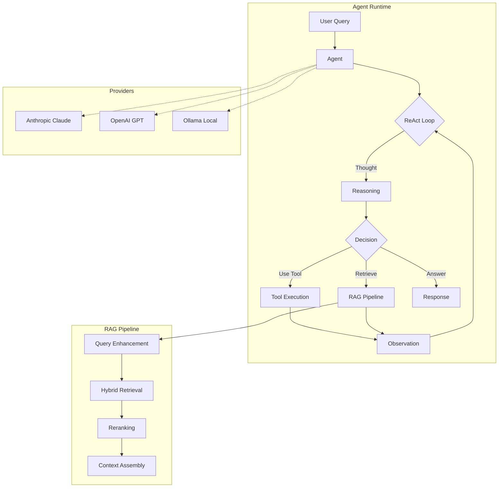

<h1 align="center">ContextAI</h1>

<p align="center">
  <strong>TypeScript-first AI Agent SDK with ReAct reasoning and production-grade RAG</strong>
</p>

<p align="center">
  <a href="https://www.npmjs.com/package/@contextai/core"></a>
  <a href="https://github.com/draco28/ContextAI/actions"></a>
  <a href="https://www.typescriptlang.org/"></a>
  <a href="https://github.com/draco28/ContextAI/blob/main/LICENSE"></a>
  <a href="https://nodejs.org/"></a>
</p>

<p align="center">
  <em>The anti-LangChain: focused, debuggable, minimal dependencies</em>
</p>

---

## Key Features

- **ReAct Reasoning** - Transparent Thought → Action → Observation loops with full tracing
- **Production RAG** - 9-stage pipeline: ingest, chunk, embed, store, enhance, retrieve, rerank, assemble, adapt
- **Provider Agnostic** - Swap LLMs (Claude, GPT, Ollama) without code changes
- **TypeScript-First** - Strict mode, full type safety, excellent DX
- **Minimal Bundle** - <50KB core package, tree-shakeable
- **Local-First Option** - Run entirely on local hardware with Ollama + HuggingFace

## Architecture



## Packages

| Package | Description | npm |
|---------|-------------|-----|
| [@contextai/core](./packages/core) | Agent runtime with ReAct loop and tool framework | [](https://www.npmjs.com/package/@contextai/core) |
| [@contextai/rag](./packages/rag) | 9-stage RAG pipeline with hybrid retrieval | [](https://www.npmjs.com/package/@contextai/rag) |
| [@contextai/provider-openai](./packages/provider-openai) | OpenAI GPT provider adapter | [](https://www.npmjs.com/package/@contextai/provider-openai) |

## Quick Start

```bash
npm install @contextai/core @contextai/rag zod
```

### Create an Agent with Tools

```typescript
import { Agent, defineTool } from '@contextai/core';
import { z } from 'zod';

// Define a tool with Zod validation
const searchTool = defineTool({
  name: 'search',
  description: 'Search for information',
  parameters: z.object({
    query: z.string().describe('Search query'),
  }),
  execute: async ({ query }) => {
    return { results: [`Result for: ${query}`] };
  },
});

// Create an agent
const agent = new Agent({
  name: 'Assistant',
  systemPrompt: 'You are a helpful assistant.',
  llm: yourLLMProvider, // See provider examples below
  tools: [searchTool],
});

// Run with full reasoning trace
const response = await agent.run('Find TypeScript tutorials');
console.log(response.output);
console.log(response.trace); // See the agent's thinking process
```

### Add RAG for Knowledge-Grounded Responses

```typescript
import { RAGEngineImpl, InMemoryVectorStore, HuggingFaceEmbeddingProvider } from '@contextai/rag';

// Set up embeddings and vector store
const embeddings = new HuggingFaceEmbeddingProvider({
  model: 'BAAI/bge-small-en-v1.5',
});

const vectorStore = new InMemoryVectorStore({
  dimensions: 384,
});

// Create RAG engine
const rag = new RAGEngineImpl({
  embeddingProvider: embeddings,
  vectorStore,
  retriever: { topK: 5 },
  reranker: { enabled: true },
});

// Ingest documents
await rag.ingest([
  { content: 'Your document content...', metadata: { source: 'docs.md' } },
]);

// Search with hybrid retrieval + reranking
const results = await rag.search('How does authentication work?');
```

### Use Different LLM Providers

```typescript
import { OpenAIProvider } from '@contextai/provider-openai';

// OpenAI
const openai = new OpenAIProvider({
  apiKey: process.env.OPENAI_API_KEY,
  model: 'gpt-4o',
});

// Use with agent
const agent = new Agent({
  name: 'Assistant',
  systemPrompt: 'You are helpful.',
  llm: openai,
});
```

## RAG Pipeline Stages

The `@contextai/rag` package implements a production-grade 9-stage pipeline:

| Stage | Component | Description |
|-------|-----------|-------------|
| 1 | **Ingest** | PDF, DOCX, TXT, Markdown, Code files |
| 2 | **Chunk** | Fixed, Recursive, Sentence-based splitting |
| 3 | **Embed** | HuggingFace BGE, Ollama embeddings |
| 4 | **Store** | In-Memory, pgvector, ChromaDB |
| 5 | **Enhance** | Query rewriting, HyDE, Multi-query expansion |
| 6 | **Retrieve** | Dense, BM25 sparse, Hybrid with RRF fusion |
| 7 | **Rerank** | BGE cross-encoder, MMR diversity, LLM reranking |
| 8 | **Assemble** | XML/Markdown formatting with citations |
| 9 | **Adapt** | Agent decides when to retrieve (Agentic RAG) |

## Comparison

| Capability | ContextAI | LangChain | LlamaIndex | CrewAI |
|------------|-----------|-----------|------------|--------|
| **Focus** | RAG + Agents | Everything | RAG | Multi-agent |
| **Language** | TypeScript-first | Python-first | Python-first | Python |
| **RAG Pipeline** | 9-stage production | Basic | Comprehensive | External |
| **Bundle Size** | <50KB core | Heavy | Heavy | Heavy |
| **Debuggability** | Full traces | Limited | Limited | Limited |
| **Provider Lock-in** | None | None | None | None |
| **Learning Curve** | Low | High | Medium | Medium |

## Performance Targets

| Metric | Target |
|--------|--------|
| Core bundle size | <50KB |
| Vector search (10K docs) | <100ms |
| Embedding latency (local) | <200ms |
| Memory baseline | <100MB |
| Cold start | <500ms |

## Documentation

- [Core Package](./packages/core/README.md) - Agent runtime and tool framework
- [RAG Package](./packages/rag/README.md) - Full RAG pipeline documentation
- [OpenAI Provider](./packages/provider-openai/README.md) - OpenAI/GPT integration
- [Architecture](./ARCHITECTURE.md) - System design and implementation details
- [SDK Capabilities](./SDK_CAPABILITIES_SUMMARY.md) - Feature comparison matrix

## Development

```bash
# Clone and install
git clone https://github.com/draco28/ContextAI.git
cd ContextAI
pnpm install

# Build all packages
pnpm build

# Run tests
pnpm test

# Type checking
pnpm typecheck

# Linting
pnpm lint
```

See [CONTRIBUTING.md](./CONTRIBUTING.md) for development guidelines.

## Roadmap

### v1.0 (Current)
- ReAct agent with tool calling
- Full 9-stage RAG pipeline
- OpenAI, Anthropic, Ollama providers
- pgvector, ChromaDB, In-Memory stores

### v1.1
- CRAG (web search fallback)
- Self-RAG evaluation
- Cohere Rerank API

### v2.0
- Graph RAG
- Multi-agent orchestration
- Multimodal RAG (images)

## License

[MIT](./LICENSE) - Copyright (c) 2025 ContextAI Contributors
