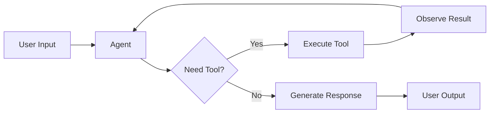
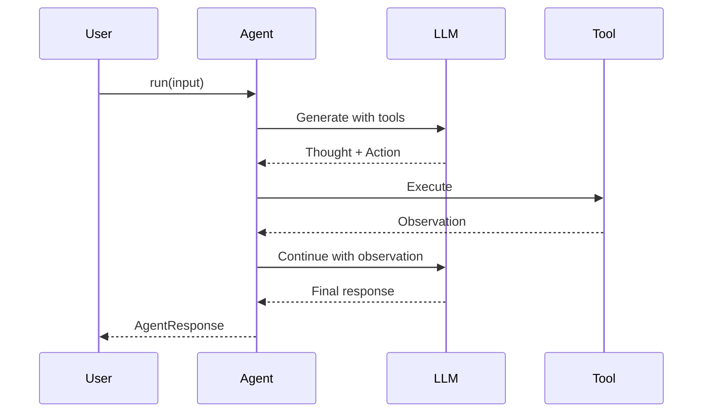

# Agents

Deep dive into ContextAI's agent architecture, configuration, and lifecycle.

## What is an Agent?

An agent is an AI system that can reason about problems and take actions to solve them. Unlike simple chatbots that just generate text, agents can:

1. **Think** - Reason about what to do next
2. **Act** - Execute tools to gather information or perform tasks
3. **Observe** - Process the results of their actions
4. **Iterate** - Repeat until the task is complete



## Creating an Agent

### Basic Agent

```typescript
import { Agent } from '@contextai/core';
import { OpenAIProvider } from '@contextai/provider-openai';

const agent = new Agent({
  name: 'Assistant',
  systemPrompt: 'You are a helpful assistant.',
  llm: new OpenAIProvider({
    apiKey: process.env.OPENAI_API_KEY!,
    model: 'gpt-4o',
  }),
});

const response = await agent.run('Hello!');
```

### Agent with Tools

```typescript
import { Agent, defineTool } from '@contextai/core';
import { z } from 'zod';

const searchTool = defineTool({
  name: 'search',
  description: 'Search the web for information',
  parameters: z.object({
    query: z.string(),
  }),
  execute: async ({ query }) => {
    // Your search implementation
    return { results: ['result1', 'result2'] };
  },
});

const agent = new Agent({
  name: 'Research Assistant',
  systemPrompt: 'You help users research topics. Use search when needed.',
  llm: provider,
  tools: [searchTool],
});
```

## Configuration Options

### AgentConfig

```typescript
interface AgentConfig {
  // Required
  name: string;              // Agent identifier
  systemPrompt: string;      // Instructions for the agent
  llm: LLMProvider;          // Language model provider

  // Optional - Tools
  tools?: Tool[];            // Available tools (default: [])

  // Optional - Iteration Control
  maxIterations?: number;    // Max tool calls (default: 10)

  // Optional - Memory
  memory?: MemoryProvider | boolean;  // Conversation memory
  sessionId?: string;        // Session identifier for memory

  // Optional - Context
  context?: string;          // Additional context to inject
  maxContextTokens?: number; // Token limit for context

  // Optional - Callbacks
  callbacks?: AgentCallbacks;  // Event handlers
  logger?: Logger;           // Custom logger
}
```

### Configuration Examples

#### Limiting Iterations

Prevent infinite loops:

```typescript
const agent = new Agent({
  name: 'Assistant',
  systemPrompt: '...',
  llm: provider,
  tools: [complexTool],
  maxIterations: 5, // Stop after 5 tool calls
});
```

#### With Memory

Enable multi-turn conversations:

```typescript
const agent = new Agent({
  name: 'Assistant',
  systemPrompt: '...',
  llm: provider,
  memory: true, // Use built-in InMemoryProvider
  sessionId: 'user-123', // Isolate conversations
});
```

#### With Context

Inject additional information:

```typescript
const agent = new Agent({
  name: 'Assistant',
  systemPrompt: 'You answer questions about the user.',
  llm: provider,
  context: `
    User Profile:
    - Name: Alice
    - Preferences: Dark mode, English
    - Account: Premium
  `,
  maxContextTokens: 1000,
});
```

## Running an Agent

### Non-Streaming (run)

Wait for complete response:

```typescript
const response = await agent.run('What is TypeScript?');

console.log(response.output);    // The final answer
console.log(response.success);   // true if successful
console.log(response.trace);     // ReAct reasoning trace
console.log(response.error);     // Error if failed
```

### Streaming (stream)

Process events as they arrive:

```typescript
for await (const event of agent.stream('Write a story')) {
  switch (event.type) {
    case 'thought':
      console.log('Thinking:', event.content);
      break;
    case 'action':
      console.log('Using tool:', event.tool);
      break;
    case 'observation':
      console.log('Result:', event.content);
      break;
    case 'text':
      process.stdout.write(event.content);
      break;
    case 'done':
      console.log('Complete:', event.response);
      break;
    case 'error':
      console.error('Error:', event.error);
      break;
  }
}
```

### With Options

Override defaults per-run:

```typescript
const response = await agent.run('Complex task', {
  maxIterations: 20,    // Override default
  context: 'Extra info', // Additional context
  signal: abortController.signal, // Cancellation
  callbacks: {
    onThought: (t) => console.log('Thought:', t),
  },
});
```

## Agent Response

### AgentResponse

```typescript
interface AgentResponse {
  output: string;        // Final text response
  success: boolean;      // True if completed successfully
  error?: Error;         // Error if failed
  trace: ReActTrace;     // Full reasoning trace
}
```

### ReActTrace

```typescript
interface ReActTrace {
  steps: ReActStep[];    // All reasoning steps
  iterations: number;    // Number of tool call cycles
  totalTokens: number;   // Total tokens used
  durationMs: number;    // Total execution time
}

type ReActStep =
  | { type: 'thought'; content: string }
  | { type: 'action'; tool: string; input: unknown }
  | { type: 'observation'; content: unknown };
```

### Inspecting Traces

```typescript
const response = await agent.run('Calculate 15% of 200');

// Iterate through reasoning
for (const step of response.trace.steps) {
  if (step.type === 'thought') {
    console.log(`Thought: ${step.content}`);
  } else if (step.type === 'action') {
    console.log(`Action: ${step.tool}(${JSON.stringify(step.input)})`);
  } else if (step.type === 'observation') {
    console.log(`Observation: ${JSON.stringify(step.content)}`);
  }
}

// Or use formatTrace utility
import { formatTrace } from '@contextai/core';
console.log(formatTrace(response.trace));
```

## Agent Lifecycle



### Lifecycle Events

Use callbacks to hook into the lifecycle:

```typescript
const agent = new Agent({
  // ... config
  callbacks: {
    onStart: (input) => {
      console.log('Starting with:', input);
    },
    onThought: (thought) => {
      console.log('Agent thinking:', thought);
    },
    onAction: (tool, input) => {
      console.log(`Calling ${tool} with:`, input);
    },
    onObservation: (result) => {
      console.log('Tool returned:', result);
    },
    onComplete: (response) => {
      console.log('Completed in', response.trace.durationMs, 'ms');
    },
    onError: (error) => {
      console.error('Agent failed:', error);
    },
  },
});
```

## Error Handling

### Agent Errors

```typescript
import { AgentError, ToolError, ToolTimeoutError } from '@contextai/core';

try {
  const response = await agent.run('Do something');
} catch (error) {
  if (error instanceof ToolTimeoutError) {
    console.log('Tool took too long:', error.toolName);
  } else if (error instanceof ToolError) {
    console.log('Tool failed:', error.toolName, error.cause);
  } else if (error instanceof AgentError) {
    console.log('Agent error:', error.code, error.message);
    // Check if retryable
    if (error.isRetryable) {
      // Retry logic
    }
  }
}
```

### Graceful Degradation

```typescript
const response = await agent.run('Complex task');

if (!response.success) {
  // Agent couldn't complete but didn't throw
  console.log('Partial result:', response.output);
  console.log('Error:', response.error?.message);

  // Check trace for what went wrong
  const lastStep = response.trace.steps.at(-1);
  if (lastStep?.type === 'observation' && lastStep.content?.error) {
    console.log('Last tool failed:', lastStep.content.error);
  }
}
```

## Best Practices

### 1. Write Clear System Prompts

```typescript
// Good: Specific, actionable instructions
const agent = new Agent({
  systemPrompt: `You are a customer support agent for TechCorp.

    Rules:
    - Be polite and professional
    - Use search_knowledge for product questions
    - Use create_ticket for unresolved issues
    - Never share internal information

    If you can't help, say "Let me connect you with a human agent."`,
});

// Bad: Vague instructions
const agent = new Agent({
  systemPrompt: 'You are helpful.',
});
```

### 2. Set Appropriate Iteration Limits

```typescript
// For simple Q&A (1-2 tool calls expected)
const agent = new Agent({
  maxIterations: 3,
});

// For complex research (many searches)
const agent = new Agent({
  maxIterations: 15,
});
```

### 3. Use Session IDs for Multi-User Apps

```typescript
// Each user gets isolated memory
const agent = new Agent({
  memory: true,
  sessionId: `user-${userId}`,
});
```

### 4. Log Traces in Production

```typescript
const response = await agent.run(input);

// Log for debugging and analytics
logger.info('Agent completed', {
  input,
  output: response.output,
  iterations: response.trace.iterations,
  tokens: response.trace.totalTokens,
  duration: response.trace.durationMs,
  tools: response.trace.steps
    .filter((s) => s.type === 'action')
    .map((s) => s.tool),
});
```

## Related Topics

- [ReAct Pattern](./react-pattern.md) - How the reasoning loop works
- [Tools](./tools.md) - Building tools for agents
- [Memory](./memory.md) - Conversation context management
- [Streaming](./streaming.md) - Real-time responses
