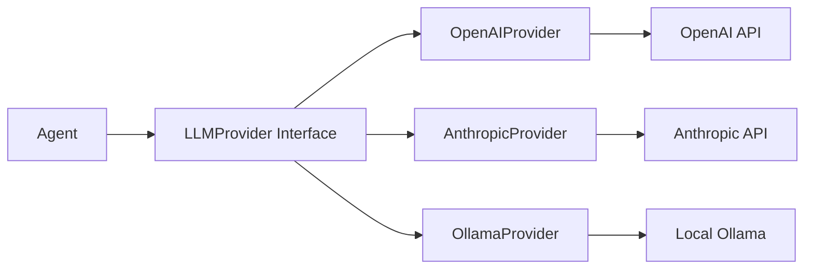

# Providers

Understanding the LLM provider abstraction layer in ContextAI.

## What is a Provider?

A provider is an adapter that connects ContextAI to a specific LLM service. All providers implement the same interface, making it easy to swap between different LLMs.



## The LLMProvider Interface

```typescript
interface LLMProvider {
  // Identity
  readonly name: string;           // Provider name (e.g., 'openai')
  readonly model: string;          // Model ID (e.g., 'gpt-4o')

  // Core methods
  chat(
    messages: ChatMessage[],
    options?: GenerateOptions
  ): Promise<ChatResponse>;

  streamChat(
    messages: ChatMessage[],
    options?: GenerateOptions
  ): AsyncGenerator<StreamChunk>;

  // Availability
  isAvailable(): Promise<boolean>;
}
```

## Available Providers

### OpenAI

```typescript
import { OpenAIProvider } from '@contextai/provider-openai';

const provider = new OpenAIProvider({
  apiKey: process.env.OPENAI_API_KEY!,
  model: 'gpt-4o',
  // Optional
  baseURL: 'https://api.openai.com/v1', // Or custom endpoint
  organization: 'org-xxx',
  timeout: 60000,
  maxRetries: 2,
});
```

### Anthropic Claude

```typescript
import { AnthropicProvider, AnthropicModels } from '@contextai/provider-anthropic';

const provider = new AnthropicProvider({
  apiKey: process.env.ANTHROPIC_API_KEY!,
  model: AnthropicModels.CLAUDE_SONNET_4,
  // Optional
  betaFeatures: ['prompt-caching-2024-07-31'],
  timeout: 60000,
  maxRetries: 2,
});
```

### Ollama (Local)

```typescript
import { OllamaProvider, OllamaModels } from '@contextai/provider-ollama';

const provider = new OllamaProvider({
  model: OllamaModels.LLAMA_3_2,
  host: 'http://localhost:11434',
  // Optional
  keepAlive: '5m',
  timeout: 120000,
});
```

## Using Providers

### With an Agent

```typescript
import { Agent } from '@contextai/core';

const agent = new Agent({
  name: 'Assistant',
  systemPrompt: 'You are helpful.',
  llm: provider, // Any LLMProvider
});
```

### Direct Usage

```typescript
// Non-streaming
const response = await provider.chat([
  { role: 'system', content: 'You are helpful.' },
  { role: 'user', content: 'Hello!' },
], {
  temperature: 0.7,
  maxTokens: 500,
});

console.log(response.content);
console.log(response.usage); // Token counts

// Streaming
for await (const chunk of provider.streamChat(messages)) {
  process.stdout.write(chunk.content);
}
```

## Message Types

### ChatMessage

```typescript
type ChatMessage = {
  role: 'system' | 'user' | 'assistant' | 'tool';
  content: string;
  // For tool results
  toolCallId?: string;
  // For tool calls (assistant)
  toolCalls?: ToolCall[];
};
```

### ChatResponse

```typescript
interface ChatResponse {
  content: string;           // Generated text
  finishReason: FinishReason; // 'stop' | 'length' | 'tool_calls'
  usage: TokenUsage;         // Token counts
  toolCalls?: ToolCall[];    // Requested tool calls
}

interface TokenUsage {
  promptTokens: number;
  completionTokens: number;
  totalTokens: number;
}
```

### StreamChunk

```typescript
interface StreamChunk {
  type: 'text' | 'tool_call' | 'thinking' | 'done';
  content: string;
  // For tool calls
  toolCall?: ToolCall;
  // For final chunk
  usage?: TokenUsage;
}
```

## Generation Options

```typescript
interface GenerateOptions {
  temperature?: number;      // 0-2, randomness (default: 1)
  maxTokens?: number;        // Max output tokens
  topP?: number;             // Nucleus sampling (0-1)
  stopSequences?: string[];  // Stop generation on these
  tools?: Tool[];            // Available tools
}
```

### Examples

```typescript
// Deterministic output
await provider.chat(messages, { temperature: 0 });

// Creative output
await provider.chat(messages, { temperature: 1.5 });

// Short responses
await provider.chat(messages, { maxTokens: 100 });

// Stop at keywords
await provider.chat(messages, { stopSequences: ['END', '---'] });
```

## Provider-Specific Features

### OpenAI

```typescript
// Use OpenRouter
const provider = new OpenAIProvider({
  apiKey: process.env.OPENROUTER_API_KEY!,
  baseURL: 'https://openrouter.ai/api/v1',
  model: 'anthropic/claude-3-opus',
});

// Use Azure OpenAI
const provider = new OpenAIProvider({
  apiKey: process.env.AZURE_OPENAI_KEY!,
  baseURL: 'https://your-resource.openai.azure.com/openai/deployments/gpt-4',
  model: 'gpt-4',
});
```

### Anthropic

```typescript
// Extended thinking (Claude 3.5+)
for await (const chunk of provider.streamChat(messages)) {
  if (chunk.type === 'thinking') {
    console.log('[Thinking]', chunk.content);
  } else {
    console.log('[Response]', chunk.content);
  }
}

// Beta features
const provider = new AnthropicProvider({
  // ...
  betaFeatures: ['prompt-caching-2024-07-31'],
});
```

### Ollama

```typescript
// List available models
const models = await provider.listModels();
console.log(models.map(m => m.name));

// Memory management
const provider = new OllamaProvider({
  model: 'llama3.2',
  keepAlive: '0', // Unload after each request
});
```

## Swapping Providers

One of ContextAI's strengths is easy provider swapping:

```typescript
// Development: Use local Ollama (free)
const devProvider = new OllamaProvider({ model: 'llama3.2' });

// Production: Use OpenAI (better quality)
const prodProvider = new OpenAIProvider({
  apiKey: process.env.OPENAI_API_KEY!,
  model: 'gpt-4o',
});

// Same agent code works with either
const agent = new Agent({
  name: 'Assistant',
  llm: process.env.NODE_ENV === 'production' ? prodProvider : devProvider,
});
```

## Checking Availability

```typescript
const provider = new OllamaProvider({ model: 'llama3.2' });

if (await provider.isAvailable()) {
  // Provider is ready
  const response = await provider.chat(messages);
} else {
  // Handle unavailability
  console.log('Start Ollama with: ollama serve');
}
```

## Error Handling

Each provider has typed errors:

```typescript
import { ProviderError } from '@contextai/core';
import { OpenAIProviderError } from '@contextai/provider-openai';
import { AnthropicProviderError } from '@contextai/provider-anthropic';
import { OllamaProviderError } from '@contextai/provider-ollama';

try {
  await provider.chat(messages);
} catch (error) {
  if (error instanceof ProviderError) {
    console.log('Provider error:', error.code);
    console.log('Message:', error.message);
    console.log('Retryable:', error.isRetryable);
    console.log('Hint:', error.troubleshootingHint);
  }
}
```

## Implementing a Custom Provider

```typescript
import { LLMProvider, ChatMessage, ChatResponse, StreamChunk } from '@contextai/core';

class MyCustomProvider implements LLMProvider {
  readonly name = 'my-custom';
  readonly model: string;

  constructor(config: { model: string; apiKey: string }) {
    this.model = config.model;
  }

  async chat(
    messages: ChatMessage[],
    options?: GenerateOptions
  ): Promise<ChatResponse> {
    // Your implementation
    const response = await myAPI.generate({
      messages: this.formatMessages(messages),
      ...options,
    });

    return {
      content: response.text,
      finishReason: 'stop',
      usage: response.usage,
    };
  }

  async *streamChat(
    messages: ChatMessage[],
    options?: GenerateOptions
  ): AsyncGenerator<StreamChunk> {
    // Your streaming implementation
    const stream = await myAPI.streamGenerate({
      messages: this.formatMessages(messages),
      ...options,
    });

    for await (const chunk of stream) {
      yield {
        type: 'text',
        content: chunk.text,
      };
    }

    yield { type: 'done', content: '' };
  }

  async isAvailable(): Promise<boolean> {
    try {
      await myAPI.healthCheck();
      return true;
    } catch {
      return false;
    }
  }

  private formatMessages(messages: ChatMessage[]) {
    // Convert to your API format
  }
}
```

## Related Topics

- [Agents](./agents.md) - Using providers with agents
- [Streaming](./streaming.md) - Real-time responses
- [OpenAI Integration](../integrations/providers/openai.md)
- [Anthropic Integration](../integrations/providers/anthropic.md)
- [Ollama Integration](../integrations/providers/ollama.md)
