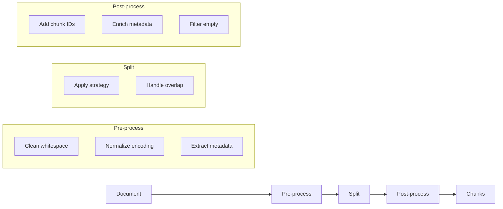

# Chunking Strategies

Understanding how to split documents for optimal retrieval.

## Why Chunking Matters

Documents must be split into chunks for embedding and retrieval:

- **Embedding models have limits** - Most handle 512 tokens efficiently
- **Retrieval granularity** - Smaller chunks = more precise retrieval
- **Context windows** - Must fit chunks into LLM context

Poor chunking leads to:
- Split concepts across chunks (loss of context)
- Overly large chunks (diluted relevance)
- Overly small chunks (missing context)

## Chunking Strategies

### FixedSizeChunker

Split by character/token count:

```typescript
import { FixedSizeChunker } from '@contextai/rag';

const chunker = new FixedSizeChunker({
  chunkSize: 512,    // Target size in tokens
  overlap: 50,       // Overlap between chunks
});

const chunks = await chunker.chunk({
  content: 'Your long document...',
  metadata: { source: 'doc.md' },
});
```

**Pros:**
- Fast and predictable
- Consistent chunk sizes
- Simple to understand

**Cons:**
- May split mid-sentence
- No awareness of document structure

**Best for:** Large homogeneous documents, logs, code

### RecursiveChunker

Split by separators, respecting document structure:

```typescript
import { RecursiveChunker } from '@contextai/rag';

const chunker = new RecursiveChunker({
  chunkSize: 512,
  separators: ['\n\n', '\n', '. ', ' '], // Try each in order
});

const chunks = await chunker.chunk(document);
```

**How it works:**
1. Try splitting by `\n\n` (paragraphs)
2. If chunks too large, split by `\n` (lines)
3. Continue with `. ` (sentences), then ` ` (words)

**Pros:**
- Respects document structure
- Keeps paragraphs/sections intact
- Better semantic coherence

**Cons:**
- Variable chunk sizes
- Slightly slower than fixed

**Best for:** Structured documents (markdown, articles, docs)

### SentenceChunker

Split by sentences, respecting semantic boundaries:

```typescript
import { SentenceChunker } from '@contextai/rag';

const chunker = new SentenceChunker({
  maxChunkSize: 512,   // Maximum tokens per chunk
  minChunkSize: 100,   // Minimum tokens (avoid tiny chunks)
});

const chunks = await chunker.chunk(document);
```

**How it works:**
1. Split document into sentences
2. Group sentences until near `maxChunkSize`
3. Ensure chunks are at least `minChunkSize`

**Pros:**
- Never splits mid-sentence
- Best semantic coherence
- Natural reading boundaries

**Cons:**
- Most variable chunk sizes
- Slower (sentence detection)

**Best for:** Natural language content, FAQs, articles

## Comparison

| Strategy | Speed | Consistency | Semantic Coherence |
|----------|-------|-------------|-------------------|
| FixedSize | Fastest | Highest | Lowest |
| Recursive | Fast | Medium | Medium |
| Sentence | Slowest | Lowest | Highest |

## Chunk Size Guidelines

### Embedding Model Limits

| Model | Max Tokens | Recommended Chunk |
|-------|------------|-------------------|
| BGE-small | 512 | 256-384 |
| BGE-large | 512 | 256-384 |
| OpenAI ada-002 | 8191 | 512-1024 |
| Nomic-embed | 8192 | 512-1024 |

### Use Case Guidelines

| Use Case | Chunk Size | Strategy |
|----------|------------|----------|
| Q&A | 256-512 | Sentence |
| Code search | 512-1024 | Fixed |
| Legal docs | 512 | Recursive |
| Chat context | 256-384 | Sentence |

## Overlap

Overlap preserves context at chunk boundaries:

```typescript
const chunker = new FixedSizeChunker({
  chunkSize: 512,
  overlap: 50, // 50 tokens shared between consecutive chunks
});
```

```
Document: [------- 512 tokens -------]
                            [------- 512 tokens -------]
                                  ↑
                              50 token
                              overlap
```

**When to use overlap:**
- Narrative content where context flows between sections
- Technical docs with cross-references
- Code with multi-line constructs

**When to skip overlap:**
- Self-contained sections (FAQs, glossaries)
- Token budget is critical
- Chunks are already sentence-aligned

## Advanced Techniques

### Metadata-Aware Chunking

Preserve and enrich metadata:

```typescript
const chunks = await chunker.chunk({
  content: documentText,
  metadata: {
    source: 'guide.md',
    category: 'authentication',
    version: '2.0',
  },
});

// Each chunk inherits metadata
chunks.forEach((chunk) => {
  console.log(chunk.metadata.source);  // 'guide.md'
  console.log(chunk.metadata.chunkIndex); // 0, 1, 2, ...
});
```

### Hierarchical Chunking

Create chunks at multiple granularities:

```typescript
// Large chunks for broad context
const largeChunker = new RecursiveChunker({ chunkSize: 1024 });
const largeChunks = await largeChunker.chunk(document);

// Small chunks for precise retrieval
const smallChunker = new RecursiveChunker({ chunkSize: 256 });
const smallChunks = await smallChunker.chunk(document);

// Index both, retrieve with different strategies
```

### Code-Aware Chunking

For code files, respect language structure:

```typescript
// Custom code chunker
function chunkCode(code: string, language: string) {
  // Split by function/class definitions
  const separators = {
    typescript: ['\nexport ', '\nfunction ', '\nclass ', '\ninterface '],
    python: ['\ndef ', '\nclass ', '\n\n'],
  };

  const chunker = new RecursiveChunker({
    chunkSize: 1024,
    separators: separators[language] || ['\n\n', '\n'],
  });

  return chunker.chunk({ content: code });
}
```

### Sliding Window

For maximum context preservation:

```typescript
function slidingWindowChunk(text: string, windowSize: number, stride: number) {
  const chunks = [];
  for (let i = 0; i < text.length; i += stride) {
    chunks.push(text.slice(i, i + windowSize));
  }
  return chunks;
}

// Window: 512 tokens, Stride: 256 tokens = 50% overlap
```

## Chunking Pipeline



## Measuring Chunk Quality

### Coherence Score

```typescript
function measureCoherence(chunk: string): number {
  // Check if chunk starts/ends mid-sentence
  const startsClean = /^[A-Z]/.test(chunk.trim());
  const endsClean = /[.!?]$/.test(chunk.trim());

  return (startsClean ? 0.5 : 0) + (endsClean ? 0.5 : 0);
}
```

### Size Distribution

```typescript
function analyzeChunks(chunks: Chunk[]) {
  const sizes = chunks.map((c) => c.content.length);

  return {
    count: chunks.length,
    minSize: Math.min(...sizes),
    maxSize: Math.max(...sizes),
    avgSize: sizes.reduce((a, b) => a + b, 0) / sizes.length,
    stdDev: calculateStdDev(sizes),
  };
}
```

## Best Practices

### 1. Match Chunk Size to Embedding Model

```typescript
// For BGE-small (512 max), use smaller chunks
const chunker = new RecursiveChunker({ chunkSize: 384 });
```

### 2. Test with Real Queries

```typescript
// Retrieve and inspect what chunks are returned
const results = await retriever.retrieve('How do I authenticate?');
results.forEach((r) => {
  console.log('Score:', r.score);
  console.log('Content:', r.content.slice(0, 100) + '...');
});
```

### 3. Consider Retrieval Strategy

```typescript
// Dense retrieval: smaller chunks (256-384)
// Hybrid retrieval: medium chunks (384-512)
// Keyword search: larger chunks (512-1024)
```

### 4. Preserve Important Boundaries

```typescript
// For markdown, preserve headers
const separators = [
  '\n## ', '\n### ', '\n#### ', // Headers
  '\n\n',                        // Paragraphs
  '\n',                          // Lines
  '. ',                          // Sentences
];
```

## Related Topics

- [RAG Overview](./overview.md) - Full pipeline
- [Retrieval](./retrieval.md) - Using chunks for search
- [How-To: Build RAG Pipeline](../../how-to/rag/build-rag-pipeline.md)
