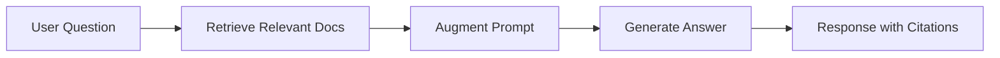
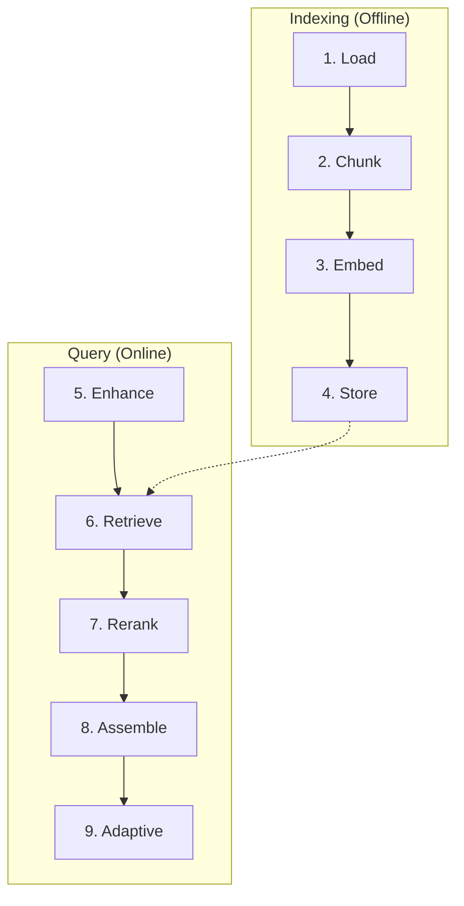

# RAG Pipeline Overview

Understanding ContextAI's 9-stage Retrieval-Augmented Generation pipeline.

## What is RAG?

RAG (Retrieval-Augmented Generation) enhances LLM responses by retrieving relevant information from a knowledge base before generating answers. Instead of relying solely on training data, the model uses real, up-to-date documents.



## The 9-Stage Pipeline

ContextAI implements a comprehensive RAG pipeline:



### Stage 1: Document Loading

Load documents from various sources:

```typescript
import { DocumentLoaderRegistry, defaultRegistry } from '@contextai/rag';

// Load a single file
const docs = await defaultRegistry.load('./data/guide.md');

// Load multiple files
const allDocs = await defaultRegistry.loadDirectory('./data');

// Custom loader
const registry = new DocumentLoaderRegistry();
registry.register('.pdf', myPDFLoader);
```

**Supported formats:** TXT, Markdown, JSON, JavaScript, TypeScript, Python

### Stage 2: Chunking

Split documents into manageable pieces:

```typescript
import { FixedSizeChunker, RecursiveChunker, SentenceChunker } from '@contextai/rag';

// Fixed-size (fastest)
const chunker = new FixedSizeChunker({ chunkSize: 512, overlap: 50 });

// Recursive (respects structure)
const chunker = new RecursiveChunker({
  chunkSize: 512,
  separators: ['\n\n', '\n', '. ', ' '],
});

// Sentence-based (semantic coherence)
const chunker = new SentenceChunker({
  maxChunkSize: 512,
  minChunkSize: 100,
});

const chunks = await chunker.chunk(document);
```

### Stage 3: Embedding

Convert text to vectors:

```typescript
import { HuggingFaceEmbeddingProvider, OllamaEmbeddingProvider } from '@contextai/rag';

// Local HuggingFace (via Transformers.js)
const embeddings = new HuggingFaceEmbeddingProvider({
  model: 'BAAI/bge-small-en-v1.5', // 384 dimensions
});

// Ollama
const embeddings = new OllamaEmbeddingProvider({
  model: 'nomic-embed-text',
});

const vector = await embeddings.embed('Your text here');
```

### Stage 4: Vector Storage

Store and index embeddings:

```typescript
import { InMemoryVectorStore } from '@contextai/rag';

const store = new InMemoryVectorStore({
  dimensions: 384,
  distanceMetric: 'cosine',
});

await store.add(chunksWithEmbeddings);
```

### Stage 5: Query Enhancement

Improve search queries:

```typescript
import { QueryRewriter, HyDEEnhancer, MultiQueryExpander } from '@contextai/rag';

// Fix typos, expand abbreviations
const rewriter = new QueryRewriter({ llm });

// Hypothetical Document Embeddings
const hyde = new HyDEEnhancer({ llm, embeddings });

// Generate multiple query variations
const expander = new MultiQueryExpander({ llm, numQueries: 3 });
```

### Stage 6: Retrieval

Find relevant chunks:

```typescript
import { DenseRetriever, BM25Retriever, HybridRetriever } from '@contextai/rag';

// Dense (semantic similarity)
const dense = new DenseRetriever({ vectorStore, embeddings, topK: 10 });

// Sparse (keyword matching)
const sparse = new BM25Retriever({ documents: chunks });

// Hybrid (best of both)
const hybrid = new HybridRetriever({
  denseRetriever: dense,
  sparseRetriever: sparse,
  denseWeight: 0.7,
  sparseWeight: 0.3,
  fusionMethod: 'rrf',
});
```

### Stage 7: Reranking

Re-score results for relevance:

```typescript
import { BGEReranker, MMRReranker, LLMReranker } from '@contextai/rag';

// Cross-encoder (most accurate)
const bge = new BGEReranker({ model: 'BAAI/bge-reranker-base' });

// MMR for diversity
const mmr = new MMRReranker({ lambda: 0.5, embeddings });

// LLM-based judging
const llm = new LLMReranker({ llm: yourLLM, batchSize: 5 });
```

### Stage 8: Context Assembly

Format for LLM consumption:

```typescript
import { XMLAssembler, MarkdownAssembler } from '@contextai/rag';

// XML (Claude-preferred)
const xml = new XMLAssembler({
  rootTag: 'context',
  chunkTag: 'document',
  includeMetadata: true,
});

// Markdown (GPT-friendly)
const md = new MarkdownAssembler({
  headerLevel: 2,
  includeCitations: true,
});

const assembled = await assembler.assemble(results, { maxTokens: 4000 });
```

### Stage 9: Adaptive RAG

Let the system decide retrieval strategy:

```typescript
import { QueryClassifier, AdaptiveRAG } from '@contextai/rag';

const classifier = new QueryClassifier({ llm });
const adaptive = new AdaptiveRAG({
  classifier,
  strategies: {
    factual: { retriever: dense, topK: 5 },
    exploratory: { retriever: hybrid, topK: 15 },
    comparison: { retriever: multiQuery, topK: 20 },
  },
});
```

## RAGEngineImpl

The main orchestrator combines all stages:

```typescript
import { RAGEngineImpl } from '@contextai/rag';

const rag = new RAGEngineImpl({
  // Required
  embeddingProvider: embeddings,
  vectorStore: store,

  // Optional (defaults provided)
  chunker: new FixedSizeChunker({ chunkSize: 512 }),
  retriever: new DenseRetriever({ vectorStore: store, embeddings }),
  reranker: new BGEReranker({ model: 'bge-reranker-base' }),
  assembler: new MarkdownAssembler(),
  queryEnhancer: undefined, // No enhancement by default
});

// Ingest documents
await rag.ingest([
  { content: 'Document text...', metadata: { source: 'doc.md' } },
]);

// Search
const results = await rag.search('How does authentication work?', {
  topK: 10,
  rerank: true,
  maxTokens: 4000,
});

console.log(results.context);  // Formatted text for LLM
console.log(results.sources);  // Source attributions
console.log(results.timings);  // Performance metrics
```

## RAG Result Structure

```typescript
interface RAGResult {
  // For LLM
  context: string;              // Formatted context
  sources: SourceAttribution[]; // Citations

  // Raw data
  chunks: SearchResult[];       // Retrieved chunks
  query: string;                // Original query
  enhancedQuery?: string;       // After enhancement

  // Metrics
  metadata: RAGSearchMetadata;
  timings: RAGTimings;
}

interface SourceAttribution {
  title: string;
  source: string;
  relevanceScore: number;
}

interface RAGTimings {
  enhanceMs?: number;
  retrieveMs: number;
  rerankMs?: number;
  assembleMs: number;
  totalMs: number;
}
```

## Pipeline Visualization

```
User Query: "How do I implement OAuth?"
                │
                ▼
┌───────────────────────────────┐
│ Stage 5: Query Enhancement    │
│ "OAuth implementation guide"  │
└───────────────────────────────┘
                │
                ▼
┌───────────────────────────────┐
│ Stage 6: Retrieval            │
│ Dense: 10 results             │
│ Sparse: 10 results            │
│ Fused: 15 unique chunks       │
└───────────────────────────────┘
                │
                ▼
┌───────────────────────────────┐
│ Stage 7: Reranking            │
│ BGE cross-encoder scoring     │
│ Top 5 selected                │
└───────────────────────────────┘
                │
                ▼
┌───────────────────────────────┐
│ Stage 8: Assembly             │
│ Format: Markdown              │
│ Tokens: 2,847                 │
│ Citations: 5 sources          │
└───────────────────────────────┘
                │
                ▼
        Context for LLM
```

## Using RAG with Agents

### As a Tool

```typescript
import { Agent, defineTool } from '@contextai/core';
import { z } from 'zod';

const searchKnowledgeTool = defineTool({
  name: 'search_knowledge',
  description: 'Search the knowledge base for relevant information',
  parameters: z.object({
    query: z.string().describe('Search query'),
  }),
  execute: async ({ query }) => {
    const results = await rag.search(query);
    return {
      context: results.context,
      sources: results.sources,
    };
  },
});

const agent = new Agent({
  name: 'Knowledge Assistant',
  systemPrompt: 'Use search_knowledge for factual questions.',
  llm: provider,
  tools: [searchKnowledgeTool],
});
```

### Direct Context Injection

```typescript
// Pre-retrieve context
const ragResults = await rag.search(userQuestion);

// Inject into agent
const response = await agent.run(userQuestion, {
  context: ragResults.context,
});
```

## Performance Considerations

| Stage | Latency | Optimization |
|-------|---------|--------------|
| Embed | 50-200ms | Batch embedding, caching |
| Retrieve | 10-100ms | Vector index tuning |
| Rerank | 100-500ms | Limit candidates, fast models |
| Assemble | <10ms | Token counting cache |

## Next Steps

- [Chunking Strategies](./chunking.md) - Deep dive into chunking
- [Retrieval Methods](./retrieval.md) - Dense, sparse, hybrid
- [Reranking](./reranking.md) - Optimizing results
- [How-To: Build RAG Pipeline](../../how-to/rag/build-rag-pipeline.md)
