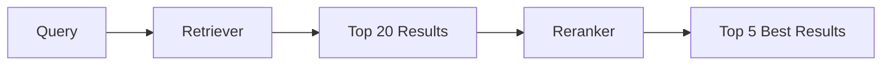

# Reranking

Optimizing retrieval results for maximum relevance.

## Why Reranking?

Initial retrieval is fast but imprecise. Reranking applies more sophisticated scoring to improve result quality:



**Before reranking:**
```
1. "Password security guidelines" (score: 0.82)
2. "Account settings overview" (score: 0.80)
3. "How to reset your password" (score: 0.78)  ← Should be #1!
```

**After reranking:**
```
1. "How to reset your password" (score: 0.95)  ← Now #1
2. "Password security guidelines" (score: 0.71)
3. "Account settings overview" (score: 0.58)
```

## Reranking Strategies

### BGE Cross-Encoder

Most accurate, uses transformer model:

```typescript
import { BGEReranker } from '@contextaisdk/rag';

const reranker = new BGEReranker({
  model: 'BAAI/bge-reranker-base',    // or 'bge-reranker-large'
});

const reranked = await reranker.rerank(
  'How do I reset my password?',
  retrievedResults
);
```

**How it works:**
1. Concatenates query + each document
2. Passes through cross-encoder model
3. Outputs relevance score (0-1)

**Pros:**
- Most accurate (attends to both query and document)
- Captures subtle relevance signals

**Cons:**
- Slow (must process each pair)
- Resource intensive

### MMR (Maximal Marginal Relevance)

Balances relevance with diversity:

```typescript
import { MMRReranker } from '@contextaisdk/rag';

const reranker = new MMRReranker({
  lambda: 0.5,      // 0 = pure diversity, 1 = pure relevance
  embeddings,       // For computing similarity
});

const reranked = await reranker.rerank(query, results);
```

**How it works:**
```
Score = λ × Relevance(doc, query) - (1-λ) × max(Similarity(doc, selected_docs))
```

**Pros:**
- Reduces redundancy
- More diverse results
- Fast (uses cached embeddings)

**Cons:**
- May sacrifice some relevance for diversity
- Requires tuning lambda

### LLM Reranker

Uses language model as judge:

```typescript
import { LLMReranker } from '@contextaisdk/rag';

const reranker = new LLMReranker({
  llm: yourLLM,
  batchSize: 5,     // Documents per LLM call
});

const reranked = await reranker.rerank(query, results);
```

**How it works:**
1. Prompts LLM to rate document relevance
2. Batches documents for efficiency
3. Parses scores from LLM output

**Pros:**
- Can understand complex relevance
- No training data needed
- Works with any LLM

**Cons:**
- Slow (LLM inference)
- Expensive (API costs)
- Less consistent than trained models

## Comparison

| Reranker | Speed | Accuracy | Diversity | Cost |
|----------|-------|----------|-----------|------|
| BGE | Medium | Highest | Low | Free |
| MMR | Fast | Medium | Highest | Free |
| LLM | Slow | High | Low | High |

## Position Bias Mitigation

LLMs have position bias (attend more to start/end). Mitigate with ordering:

### Sandwich Ordering

Place most relevant at start AND end:

```typescript
import { applySandwichOrdering } from '@contextaisdk/rag';

// Input:  [1, 2, 3, 4, 5] (by relevance)
// Output: [1, 3, 5, 4, 2] (sandwich pattern)
const ordered = applySandwichOrdering(results);
```

```
Most relevant    →  Position 1 (attended)
Second most      →  Position 5 (attended)
Third            →  Position 2
Fourth           →  Position 4
Fifth            →  Position 3 (middle, least attended)
```

### Interleave Ordering

Alternates high and low relevance:

```typescript
import { applyInterleaveOrdering } from '@contextaisdk/rag';

// Input:  [1, 2, 3, 4, 5]
// Output: [1, 5, 2, 4, 3]
const ordered = applyInterleaveOrdering(results);
```

## Multi-Stage Reranking

Combine strategies for best results:

```typescript
async function multiStageRerank(query: string, results: Result[]) {
  // Stage 1: BGE for accuracy (top 20 → top 10)
  const bge = new BGEReranker({ model: 'bge-reranker-base' });
  const stage1 = await bge.rerank(query, results.slice(0, 20));

  // Stage 2: MMR for diversity (top 10 → top 5)
  const mmr = new MMRReranker({ lambda: 0.7, embeddings });
  const stage2 = await mmr.rerank(query, stage1.slice(0, 10));

  return stage2.slice(0, 5);
}
```

## Configuration Options

### BGEReranker

```typescript
const reranker = new BGEReranker({
  model: 'BAAI/bge-reranker-base',  // or 'bge-reranker-large'
  batchSize: 8,                      // Parallel processing
  normalizeScores: true,             // Scale to 0-1
});
```

### MMRReranker

```typescript
const reranker = new MMRReranker({
  lambda: 0.5,          // 0-1, higher = more relevance
  embeddings,           // EmbeddingProvider for similarity
  diversityThreshold: 0.8, // Skip if too similar
});
```

### LLMReranker

```typescript
const reranker = new LLMReranker({
  llm: provider,
  batchSize: 5,
  prompt: `Rate relevance 0-10:
    Query: {query}
    Document: {document}
    Score:`,
});
```

## Pipeline Integration

### With RAGEngineImpl

```typescript
const rag = new RAGEngineImpl({
  embeddingProvider,
  vectorStore,
  retriever: new HybridRetriever({ /* ... */ }),
  reranker: new BGEReranker({ model: 'bge-reranker-base' }),
  assembler: new MarkdownAssembler(),
});

const results = await rag.search(query, {
  topK: 20,     // Retrieve 20
  rerank: true, // Apply reranking
  finalK: 5,    // Keep top 5 after reranking
});
```

### Manual Pipeline

```typescript
// 1. Retrieve
const retrieved = await retriever.retrieve(query, { topK: 20 });

// 2. Rerank
const reranked = await reranker.rerank(query, retrieved);

// 3. Select top
const top = reranked.slice(0, 5);

// 4. Apply position bias mitigation
const ordered = applySandwichOrdering(top);

// 5. Assemble
const context = await assembler.assemble(ordered);
```

## Performance Tips

### 1. Limit Reranking Candidates

```typescript
// Don't rerank everything
const topCandidates = retrieved.slice(0, 20); // Not all 100
const reranked = await reranker.rerank(query, topCandidates);
```

### 2. Use Smaller Models First

```typescript
// Fast first pass with BGE-base
const bgeBase = new BGEReranker({ model: 'bge-reranker-base' });
const stage1 = await bgeBase.rerank(query, results.slice(0, 50));

// Accurate second pass with BGE-large (fewer docs)
const bgeLarge = new BGEReranker({ model: 'bge-reranker-large' });
const stage2 = await bgeLarge.rerank(query, stage1.slice(0, 10));
```

### 3. Cache Reranker Models

```typescript
// Load once, reuse
let reranker: BGEReranker | null = null;

function getReranker() {
  if (!reranker) {
    reranker = new BGEReranker({ model: 'bge-reranker-base' });
  }
  return reranker;
}
```

### 4. Batch Processing

```typescript
// Multiple queries? Batch them
const queries = ['query1', 'query2', 'query3'];
const resultSets = await Promise.all(
  queries.map((q) => retriever.retrieve(q))
);
const rerankedSets = await Promise.all(
  queries.map((q, i) => reranker.rerank(q, resultSets[i]))
);
```

## Evaluation

### NDCG (Normalized Discounted Cumulative Gain)

Measures ranking quality:

```typescript
function ndcg(results: Result[], relevance: Map<string, number>, k: number) {
  // DCG = sum(relevance[i] / log2(i + 2))
  let dcg = 0;
  for (let i = 0; i < k && i < results.length; i++) {
    const rel = relevance.get(results[i].id) || 0;
    dcg += rel / Math.log2(i + 2);
  }

  // IDCG = DCG of ideal ranking
  const ideal = [...relevance.values()].sort((a, b) => b - a);
  let idcg = 0;
  for (let i = 0; i < k && i < ideal.length; i++) {
    idcg += ideal[i] / Math.log2(i + 2);
  }

  return idcg === 0 ? 0 : dcg / idcg;
}
```

### A/B Testing

```typescript
async function compareRerankers(queries: string[], results: Result[][]) {
  const bge = new BGEReranker({ model: 'bge-reranker-base' });
  const mmr = new MMRReranker({ lambda: 0.7, embeddings });

  for (let i = 0; i < queries.length; i++) {
    const bgeResults = await bge.rerank(queries[i], results[i]);
    const mmrResults = await mmr.rerank(queries[i], results[i]);

    console.log({
      query: queries[i],
      bgeTop: bgeResults[0].content.slice(0, 50),
      mmrTop: mmrResults[0].content.slice(0, 50),
    });
  }
}
```

## Related Topics

- [RAG Overview](./overview.md) - Full pipeline
- [Retrieval](./retrieval.md) - Getting initial results
- [How-To: Build RAG Pipeline](../../how-to/rag/build-rag-pipeline.md)
