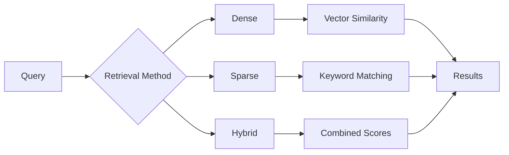

# Retrieval Methods

Understanding dense, sparse, and hybrid retrieval in ContextAI RAG.

## Retrieval Fundamentals

Retrieval finds relevant chunks for a given query. The quality of retrieval directly impacts RAG output quality.



## Dense Retrieval

Uses vector embeddings for semantic similarity:

```typescript
import { DenseRetriever } from '@contextai/rag';

const retriever = new DenseRetriever({
  vectorStore,
  embeddings,
  topK: 10,
});

const results = await retriever.retrieve('How do I reset my password?');
```

### How It Works

1. Query is embedded into a vector
2. Find nearest vectors in the store
3. Return chunks with highest similarity

```
Query: "How do I reset my password?"
    ↓ embed
Query Vector: [0.23, -0.45, 0.12, ...]
    ↓ similarity search
Chunk 1: "Password Reset Guide" (score: 0.92)
Chunk 2: "Account Recovery Steps" (score: 0.87)
Chunk 3: "Security Settings" (score: 0.75)
```

### Strengths

- **Semantic understanding** - "reset password" matches "account recovery"
- **Handles synonyms** - "car" matches "automobile"
- **Context-aware** - Understands meaning, not just keywords

### Weaknesses

- **Rare terms** - May miss specific product names, codes
- **Exact matching** - "Python 3.12" might match "Python" generically
- **Embedding quality** - Only as good as the embedding model

### Configuration

```typescript
const retriever = new DenseRetriever({
  vectorStore,
  embeddings,
  topK: 10,              // Number of results
  scoreThreshold: 0.5,   // Minimum similarity
  filter: {              // Metadata filtering
    category: 'docs',
  },
});
```

## Sparse Retrieval (BM25)

Uses keyword/term frequency for exact matching:

```typescript
import { BM25Retriever } from '@contextai/rag';

const retriever = new BM25Retriever({
  documents: chunks,
  k1: 1.2,    // Term frequency saturation
  b: 0.75,   // Length normalization
});

const results = await retriever.retrieve('ERROR_CODE_404');
```

### How It Works

BM25 scores documents based on:
- Term frequency (TF) in document
- Inverse document frequency (IDF) across corpus
- Document length normalization

```
Query: "ERROR_CODE_404"
    ↓ tokenize
Terms: ["error", "code", "404"]
    ↓ BM25 scoring
Chunk 1: "Error Code 404 means..." (score: 12.5)
Chunk 2: "HTTP 404 Not Found" (score: 8.3)
Chunk 3: "Common Error Messages" (score: 3.1)
```

### Strengths

- **Exact matching** - Great for codes, IDs, names
- **No embeddings needed** - Faster indexing
- **Rare term handling** - Unique terms get high weight

### Weaknesses

- **No semantic understanding** - "car" won't match "automobile"
- **Vocabulary mismatch** - Query must use same terms as docs
- **Keyword stuffing** - Can be gamed

### Configuration

```typescript
const retriever = new BM25Retriever({
  documents: chunks,
  k1: 1.2,    // Higher = more term frequency weight
  b: 0.75,   // Higher = more length normalization
  topK: 10,
});
```

## Hybrid Retrieval

Combines dense and sparse for best of both:

```typescript
import { HybridRetriever } from '@contextai/rag';

const retriever = new HybridRetriever({
  denseRetriever: denseRetriever,
  sparseRetriever: sparseRetriever,
  denseWeight: 0.7,
  sparseWeight: 0.3,
  fusionMethod: 'rrf',
});

const results = await retriever.retrieve('How to fix ERROR_CODE_404?');
```

### Fusion Methods

#### Reciprocal Rank Fusion (RRF)

Combines rankings, not scores:

```typescript
import { reciprocalRankFusion, DEFAULT_RRF_K } from '@contextai/rag';

// Score = sum(1 / (k + rank)) for each result list
const fused = reciprocalRankFusion([denseResults, sparseResults], {
  k: DEFAULT_RRF_K, // 60 (standard value)
});
```

**Pros:** Works across different score scales
**Cons:** Ignores actual score magnitudes

#### Weighted Sum

Combines normalized scores:

```typescript
const retriever = new HybridRetriever({
  denseRetriever,
  sparseRetriever,
  denseWeight: 0.7,
  sparseWeight: 0.3,
  fusionMethod: 'weighted_sum',
});
```

**Pros:** Respects score magnitudes
**Cons:** Requires score normalization

### When to Use Hybrid

| Scenario | Method | Why |
|----------|--------|-----|
| General Q&A | Hybrid (0.7/0.3) | Balance meaning + keywords |
| Technical docs | Hybrid (0.5/0.5) | Mix semantic + exact |
| Code search | Sparse-heavy (0.3/0.7) | Exact names matter |
| Conversational | Dense-heavy (0.9/0.1) | Semantic understanding |

## Retrieval Configuration

### Top-K Selection

```typescript
// More results = higher recall, lower precision
const retriever = new DenseRetriever({ topK: 20 });

// Fewer results = higher precision, lower recall
const retriever = new DenseRetriever({ topK: 5 });
```

### Score Thresholds

```typescript
// Filter out low-quality matches
const retriever = new DenseRetriever({
  topK: 20,
  scoreThreshold: 0.6, // Only results with score >= 0.6
});
```

### Metadata Filtering

```typescript
// Filter by metadata before similarity search
const retriever = new DenseRetriever({
  filter: {
    category: 'documentation',
    version: '2.0',
    language: 'en',
  },
});
```

## Multi-Query Retrieval

Expand query into multiple variations:

```typescript
import { MultiQueryExpander } from '@contextai/rag';

const expander = new MultiQueryExpander({
  llm: yourLLM,
  numQueries: 3,
});

// "password reset" becomes:
// - "password reset"
// - "how to recover account password"
// - "forgot password steps"

const queries = await expander.enhance('password reset');
```

Then retrieve for each query and merge results:

```typescript
const allResults = [];
for (const query of queries) {
  const results = await retriever.retrieve(query);
  allResults.push(...results);
}
const merged = deduplicateAndRank(allResults);
```

## Performance Optimization

### 1. Batch Queries

```typescript
// Instead of sequential
for (const query of queries) {
  await retriever.retrieve(query);
}

// Use parallel
const results = await Promise.all(
  queries.map((q) => retriever.retrieve(q))
);
```

### 2. Pre-filter by Metadata

```typescript
// Narrow search space first
const retriever = new DenseRetriever({
  filter: { category: userCategory },
  topK: 10,
});
```

### 3. Cache Embeddings

```typescript
import { CachedEmbeddingProvider } from '@contextai/rag';

const cached = new CachedEmbeddingProvider({
  provider: embeddings,
  cache: new LRUCache({ max: 10000 }),
});
```

### 4. Index Tuning

| Store | Tuning |
|-------|--------|
| In-Memory | Use HNSW index |
| pgvector | `lists` and `probes` params |
| Pinecone | Pod type selection |

## Evaluation Metrics

### Recall@K

What fraction of relevant docs are in top K?

```typescript
function recallAtK(results: Result[], relevant: string[], k: number) {
  const topK = results.slice(0, k).map((r) => r.id);
  const hits = topK.filter((id) => relevant.includes(id));
  return hits.length / relevant.length;
}
```

### MRR (Mean Reciprocal Rank)

Where does the first relevant result appear?

```typescript
function mrr(results: Result[], relevant: string[]) {
  for (let i = 0; i < results.length; i++) {
    if (relevant.includes(results[i].id)) {
      return 1 / (i + 1);
    }
  }
  return 0;
}
```

### NDCG (Normalized Discounted Cumulative Gain)

Quality of ranking considering position:

```typescript
// Higher-ranked relevant items contribute more
```

## Best Practices

### 1. Start with Hybrid

```typescript
// Good default configuration
const retriever = new HybridRetriever({
  denseWeight: 0.7,
  sparseWeight: 0.3,
  fusionMethod: 'rrf',
});
```

### 2. Tune Weights by Domain

```typescript
// Technical docs: more sparse
{ denseWeight: 0.5, sparseWeight: 0.5 }

// Conversational: more dense
{ denseWeight: 0.8, sparseWeight: 0.2 }
```

### 3. Retrieve More, Rerank

```typescript
// Retrieve generous amount
const results = await retriever.retrieve(query, { topK: 20 });

// Rerank to find best
const reranked = await reranker.rerank(query, results);

// Use top after reranking
const final = reranked.slice(0, 5);
```

### 4. Monitor Retrieval Quality

```typescript
// Log retrieval for analysis
console.log({
  query,
  topResults: results.slice(0, 3).map((r) => ({
    score: r.score,
    content: r.content.slice(0, 100),
  })),
});
```

## Related Topics

- [RAG Overview](./overview.md) - Full pipeline
- [Chunking](./chunking.md) - Preparing documents
- [Reranking](./reranking.md) - Optimizing results
- [How-To: Hybrid Search](../../how-to/rag/hybrid-search.md)
