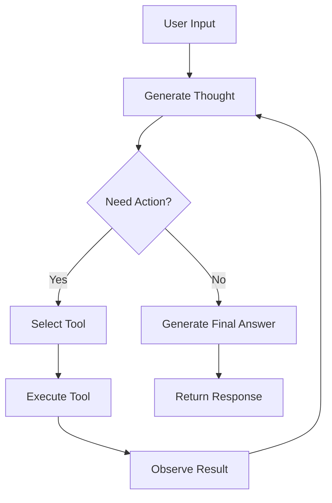

# ReAct Pattern

Understanding the ReAct (Reasoning + Acting) pattern that powers ContextAI agents.

## What is ReAct?

ReAct is a prompting paradigm that interleaves reasoning (thinking) with acting (tool use). Instead of just generating text, the model:

1. **Reasons** about what to do (Thought)
2. **Takes action** using a tool (Action)
3. **Observes** the result (Observation)
4. **Repeats** until the task is complete

This approach leads to more reliable and explainable AI behavior.

## The ReAct Loop



### Example Trace

**User**: "What's the weather in Tokyo and should I bring an umbrella?"

```
Thought: I need to check the current weather in Tokyo to answer this question.

Action: get_weather
Input: { "city": "Tokyo" }

Observation: { "temperature": 18, "condition": "Light rain", "humidity": 75 }

Thought: It's raining in Tokyo. I should recommend bringing an umbrella.

Answer: The weather in Tokyo is 18°C with light rain. Yes, you should definitely bring an umbrella!
```

## How ContextAI Implements ReAct

### The ReActLoop Class

```typescript
// Internal implementation (simplified)
class ReActLoop {
  async execute(input: string): Promise<AgentResponse> {
    const steps: ReActStep[] = [];
    let iterations = 0;

    while (iterations < this.maxIterations) {
      // Generate thought + optional action
      const llmResponse = await this.llm.chat(
        this.buildMessages(input, steps)
      );

      // Parse response for thought/action
      const { thought, action } = this.parseResponse(llmResponse);

      if (thought) {
        steps.push({ type: 'thought', content: thought });
      }

      if (action) {
        // Execute tool
        steps.push({ type: 'action', tool: action.name, input: action.input });
        const result = await this.executeTool(action);
        steps.push({ type: 'observation', content: result });
        iterations++;
      } else {
        // No action = final answer
        return this.buildResponse(llmResponse, steps);
      }
    }

    throw new AgentError('MAX_ITERATIONS_EXCEEDED');
  }
}
```

### Trace Structure

```typescript
interface ReActTrace {
  steps: ReActStep[];      // Ordered sequence of steps
  iterations: number;      // Number of tool call cycles
  totalTokens: number;     // Tokens consumed
  durationMs: number;      // Total time
}

type ReActStep =
  | ThoughtStep
  | ActionStep
  | ObservationStep;

interface ThoughtStep {
  type: 'thought';
  content: string;         // The agent's reasoning
}

interface ActionStep {
  type: 'action';
  tool: string;            // Tool name
  input: unknown;          // Tool parameters
}

interface ObservationStep {
  type: 'observation';
  content: unknown;        // Tool result
}
```

## Trace Utilities

### formatTrace

Human-readable trace output:

```typescript
import { formatTrace } from '@contextai/core';

const response = await agent.run('What is 15% of 200?');
console.log(formatTrace(response.trace));
```

Output:
```
=== ReAct Trace ===

[Thought] I need to calculate 15% of 200. I'll use the calculator tool.

[Action] calculator({ expression: "200 * 0.15" })

[Observation] { result: 30 }

[Thought] The calculation is complete. 15% of 200 is 30.

=== Stats ===
Iterations: 1
Tokens: 245
Duration: 1.2s
```

### formatTraceJSON

Structured JSON output for logging:

```typescript
import { formatTraceJSON } from '@contextai/core';

const json = formatTraceJSON(response.trace);
console.log(JSON.stringify(json, null, 2));
```

### getTraceStats

Extract statistics:

```typescript
import { getTraceStats } from '@contextai/core';

const stats = getTraceStats(response.trace);
console.log(stats);
// {
//   thoughtCount: 2,
//   actionCount: 1,
//   observationCount: 1,
//   uniqueTools: ['calculator'],
//   avgTokensPerIteration: 245,
//   avgDurationPerIteration: 1200
// }
```

## Controlling the Loop

### Max Iterations

Prevent infinite loops:

```typescript
const agent = new Agent({
  // ...
  maxIterations: 5, // Stop after 5 tool calls
});
```

If max iterations is reached:
- Agent attempts to provide a partial answer
- `response.success` may be `false`
- Check `response.trace` to see what happened

### Iteration Callbacks

Monitor each iteration:

```typescript
const agent = new Agent({
  // ...
  callbacks: {
    onThought: (thought) => {
      console.log(`[${Date.now()}] Thought: ${thought}`);
    },
    onAction: (tool, input) => {
      console.log(`[${Date.now()}] Action: ${tool}`, input);
    },
    onObservation: (result) => {
      console.log(`[${Date.now()}] Observation:`, result);
    },
  },
});
```

### Cancellation

Abort mid-execution:

```typescript
const controller = new AbortController();

// Cancel after 5 seconds
setTimeout(() => controller.abort(), 5000);

try {
  const response = await agent.run('Complex task', {
    signal: controller.signal,
  });
} catch (error) {
  if (error.name === 'AbortError') {
    console.log('Agent was cancelled');
  }
}
```

## Why ReAct Works

### 1. Explicit Reasoning

The model must articulate its reasoning before acting:

```
Thought: The user wants to know about the weather. I should use the weather tool
         because I don't have real-time data.
```

This catches errors before they happen.

### 2. Grounded in Observations

Actions produce real data that grounds subsequent reasoning:

```
Action: search({ query: "TypeScript release date" })
Observation: "TypeScript was released on October 1, 2012"
Thought: I now have factual information to answer with.
```

### 3. Self-Correction

Observations can reveal errors:

```
Action: calculator({ expression: "1/0" })
Observation: { error: "Division by zero" }
Thought: The calculation failed. I need to handle this case differently.
```

### 4. Transparency

Every step is visible for debugging:

```typescript
// Find where things went wrong
const failedAction = response.trace.steps.find(
  (s) => s.type === 'observation' && s.content?.error
);

if (failedAction) {
  console.log('Tool failed:', failedAction.content.error);
}
```

## ReAct vs Other Patterns

| Pattern | Reasoning | Tool Use | Transparency |
|---------|-----------|----------|--------------|
| ReAct | Explicit thoughts | Interleaved | Full trace |
| Chain-of-Thought | Implicit in output | None | Partial |
| Function Calling | None | Direct | Tool calls only |
| Plan-Execute | Up-front plan | Sequential | Plan visible |

## Advanced: Custom Prompts

The ReAct prompt can be customized via the system prompt:

```typescript
const agent = new Agent({
  systemPrompt: `You are a research assistant. Follow this reasoning process:

1. THINK: Analyze what information you need
2. SEARCH: Use search_papers to find relevant research
3. ANALYZE: Read and understand the findings
4. SYNTHESIZE: Combine information into a coherent answer

Always cite your sources with [Author, Year] format.`,
});
```

## Debugging Tips

### 1. Always Log Traces in Development

```typescript
const response = await agent.run(input);
console.log(formatTrace(response.trace));
```

### 2. Check for Loops

```typescript
const stats = getTraceStats(response.trace);
if (stats.actionCount === agent.maxIterations) {
  console.warn('Agent hit max iterations - might be stuck');
}
```

### 3. Analyze Tool Usage

```typescript
const toolCalls = response.trace.steps
  .filter((s) => s.type === 'action')
  .map((s) => s.tool);

console.log('Tools used:', [...new Set(toolCalls)]);
```

### 4. Find Errors

```typescript
const errors = response.trace.steps
  .filter((s) => s.type === 'observation' && s.content?.error);

if (errors.length > 0) {
  console.log('Tool errors:', errors);
}
```

## Related Topics

- [Agents](./agents.md) - Agent configuration
- [Tools](./tools.md) - Building tools for ReAct
- [Streaming](./streaming.md) - Real-time ReAct events
