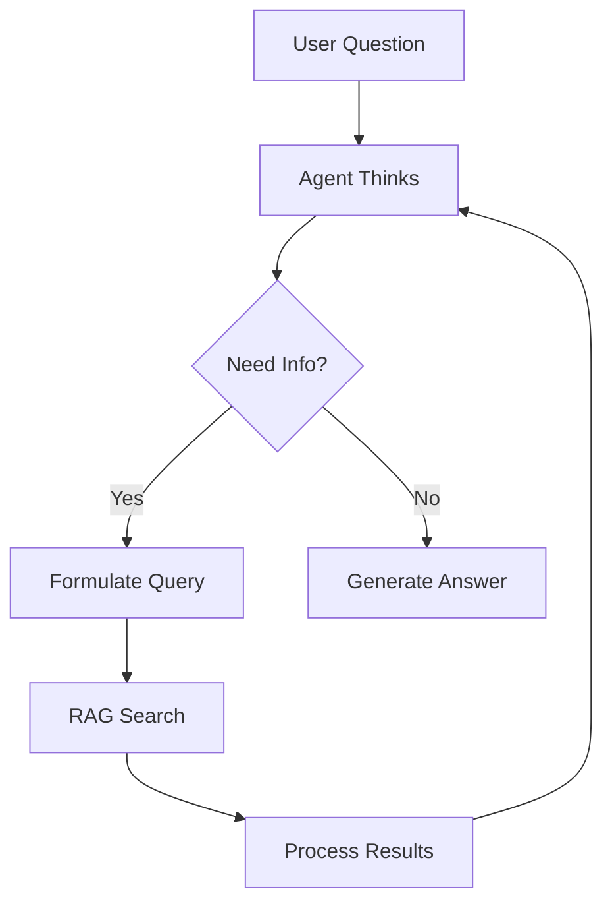

# How to Build Agentic RAG

Let agents decide when and how to retrieve information.

## What is Agentic RAG?

Instead of always retrieving before answering, the agent decides:
- **When** to retrieve (only if needed)
- **What** to search for (formulates its own queries)
- **How many** searches to perform (iterative refinement)



## Basic Agentic RAG

### Create the RAG Tool

```typescript
import { defineTool } from '@contextaisdk/core';
import { z } from 'zod';

const searchKnowledgeTool = defineTool({
  name: 'search_knowledge',
  description: `Search the knowledge base for relevant information.
    Use this when you need facts, documentation, or specific details.
    Formulate clear, specific search queries for best results.`,
  parameters: z.object({
    query: z.string().describe('Search query - be specific'),
    maxResults: z.number().optional().default(5)
      .describe('Number of results to return'),
  }),
  execute: async ({ query, maxResults }) => {
    const results = await rag.search(query, {
      topK: maxResults,
      rerank: true,
    });

    return {
      context: results.context,
      sources: results.sources.map((s) => ({
        title: s.title,
        source: s.source,
      })),
      resultCount: results.chunks.length,
    };
  },
});
```

### Create the Agent

```typescript
import { Agent } from '@contextaisdk/core';

const agent = new Agent({
  name: 'Knowledge Assistant',
  systemPrompt: `You are a helpful assistant with access to a knowledge base.

    Guidelines:
    - Use search_knowledge when you need factual information
    - Don't search for things you already know (general knowledge)
    - Formulate specific queries for better results
    - You can search multiple times if needed
    - Always cite sources when using retrieved information

    Example good queries:
    - "JWT token authentication flow"
    - "API rate limiting configuration"
    - "Error code E001 troubleshooting"

    Example bad queries:
    - "tell me everything" (too vague)
    - "what is JavaScript" (general knowledge)`,
  llm: provider,
  tools: [searchKnowledgeTool],
});
```

### Use It

```typescript
const response = await agent.run(
  'How do I authenticate API requests in our system?'
);

console.log(response.output);

// See the agent's reasoning
for (const step of response.trace.steps) {
  if (step.type === 'thought') {
    console.log('Thought:', step.content);
  } else if (step.type === 'action') {
    console.log('Search:', step.input.query);
  }
}
```

## Multi-Step Retrieval

### Iterative Search

```typescript
const agent = new Agent({
  systemPrompt: `You can search multiple times to gather information.

    Strategy:
    1. Start with a broad search to understand the topic
    2. Follow up with specific searches for details
    3. Synthesize all information into a comprehensive answer`,
  tools: [searchKnowledgeTool],
  maxIterations: 10, // Allow multiple searches
});

const response = await agent.run(
  'Compare our authentication methods and recommend which to use'
);

// Agent might:
// 1. Search "authentication methods overview"
// 2. Search "JWT authentication pros cons"
// 3. Search "OAuth implementation guide"
// 4. Synthesize findings
```

### Query Refinement

```typescript
const agent = new Agent({
  systemPrompt: `If initial search results are insufficient:
    1. Analyze what's missing
    2. Reformulate with more specific terms
    3. Try alternative phrasings

    Example:
    - First: "error handling" (too broad)
    - Refined: "API error response codes 4xx"`,
  tools: [searchKnowledgeTool],
});
```

## Multiple Knowledge Sources

### Specialized Tools

```typescript
const searchDocsTool = defineTool({
  name: 'search_docs',
  description: 'Search technical documentation',
  parameters: z.object({ query: z.string() }),
  execute: async ({ query }) => docsRag.search(query),
});

const searchFaqTool = defineTool({
  name: 'search_faq',
  description: 'Search frequently asked questions',
  parameters: z.object({ query: z.string() }),
  execute: async ({ query }) => faqRag.search(query),
});

const searchCodeTool = defineTool({
  name: 'search_code',
  description: 'Search code examples and snippets',
  parameters: z.object({ query: z.string() }),
  execute: async ({ query }) => codeRag.search(query),
});

const agent = new Agent({
  systemPrompt: `You have access to multiple knowledge bases:
    - search_docs: Technical documentation
    - search_faq: Frequently asked questions
    - search_code: Code examples

    Choose the appropriate source for each query.`,
  tools: [searchDocsTool, searchFaqTool, searchCodeTool],
});
```

### Conditional Retrieval

```typescript
const agent = new Agent({
  systemPrompt: `Decide if you need to search:

    DON'T search for:
    - General programming concepts
    - Common knowledge
    - Simple calculations

    DO search for:
    - Our specific APIs and features
    - Internal documentation
    - Company-specific procedures`,
  tools: [searchKnowledgeTool],
});

// Agent won't search for "what is a variable"
// Agent will search for "our user authentication API"
```

## Context-Aware Retrieval

### With User Context

```typescript
const searchWithContextTool = defineTool({
  name: 'search_knowledge',
  parameters: z.object({
    query: z.string(),
  }),
  execute: async ({ query }, context) => {
    // Filter based on user's access level
    const userTier = context.metadata?.userTier || 'basic';

    const results = await rag.search(query, {
      filter: {
        accessLevel: { $lte: userTier },
      },
    });

    return results;
  },
});

const agent = new Agent({
  tools: [searchWithContextTool],
  context: `User tier: premium`, // Injected context
});
```

### With Conversation History

```typescript
const agent = new Agent({
  systemPrompt: `Consider previous conversation when searching.

    If user asks a follow-up question:
    - Reference earlier topics in your search
    - Don't search for things already retrieved`,
  tools: [searchKnowledgeTool],
  memory: true,
  sessionId: 'user-session',
});

// Conversation:
// User: "How does authentication work?"
// Agent: [searches, answers]
// User: "What about refresh tokens?"
// Agent: [searches "refresh tokens authentication" - more specific]
```

## Combining RAG with Actions

```typescript
const searchTool = defineTool({
  name: 'search_knowledge',
  description: 'Search for information',
  // ...
});

const createTicketTool = defineTool({
  name: 'create_ticket',
  description: 'Create a support ticket',
  parameters: z.object({
    title: z.string(),
    description: z.string(),
    priority: z.enum(['low', 'medium', 'high']),
  }),
  execute: async (input) => {
    const ticket = await ticketService.create(input);
    return { ticketId: ticket.id };
  },
});

const agent = new Agent({
  systemPrompt: `You are a support agent.

    1. First, search_knowledge to find solutions
    2. If you can solve the issue, provide the solution
    3. If you can't, create_ticket for human review`,
  tools: [searchTool, createTicketTool],
});

const response = await agent.run(
  'I keep getting ERROR_AUTH_001 when logging in'
);

// Agent might:
// 1. Search "ERROR_AUTH_001 troubleshooting"
// 2. If found: provide solution
// 3. If not: create support ticket
```

## Evaluation & Debugging

### Trace Analysis

```typescript
const response = await agent.run(query);

// Analyze RAG usage
const searches = response.trace.steps
  .filter((s) => s.type === 'action' && s.tool === 'search_knowledge');

console.log('Number of searches:', searches.length);
searches.forEach((s, i) => {
  console.log(`Search ${i + 1}: "${s.input.query}"`);
});

// Did agent find what it needed?
const observations = response.trace.steps
  .filter((s) => s.type === 'observation');

observations.forEach((o, i) => {
  console.log(`Results ${i + 1}:`, o.content.resultCount, 'chunks');
});
```

### Quality Metrics

```typescript
async function evaluateAgenticRAG(testCases: TestCase[]) {
  const results = [];

  for (const { question, expectedSearch, expectedInAnswer } of testCases) {
    const response = await agent.run(question);

    // Did it search?
    const searched = response.trace.steps.some(
      (s) => s.type === 'action' && s.tool === 'search_knowledge'
    );

    // Did it find relevant info?
    const answer = response.output.toLowerCase();
    const hasExpected = expectedInAnswer.every(
      (term) => answer.includes(term.toLowerCase())
    );

    results.push({
      question,
      searched,
      shouldHaveSearched: expectedSearch,
      hasExpectedTerms: hasExpected,
      pass: searched === expectedSearch && hasExpected,
    });
  }

  return results;
}
```

## Best Practices

### 1. Clear Tool Descriptions

```typescript
// Good: Specific about when to use
description: `Search product documentation for technical details.
  Use for: API specs, configuration options, error codes.
  Don't use for: general programming questions.`

// Bad: Vague
description: 'Search for stuff'
```

### 2. Guide Query Formulation

```typescript
systemPrompt: `When searching:
  - Use specific terms from the user's question
  - Include relevant context (e.g., "authentication" + "API")
  - If results are poor, try synonyms or related terms`
```

### 3. Limit Iterations

```typescript
const agent = new Agent({
  maxIterations: 5, // Don't let it search forever
});
```

### 4. Return Useful Metadata

```typescript
execute: async ({ query }) => {
  const results = await rag.search(query);
  return {
    context: results.context,
    sources: results.sources, // For citations
    confidence: results.chunks[0]?.score || 0, // Quality indicator
  };
}
```

## Next Steps

- [Build RAG Pipeline](./build-rag-pipeline.md) - Set up RAG
- [Hybrid Search](./hybrid-search.md) - Better retrieval
- [ReAct Pattern](../../concepts/react-pattern.md) - Agent reasoning
