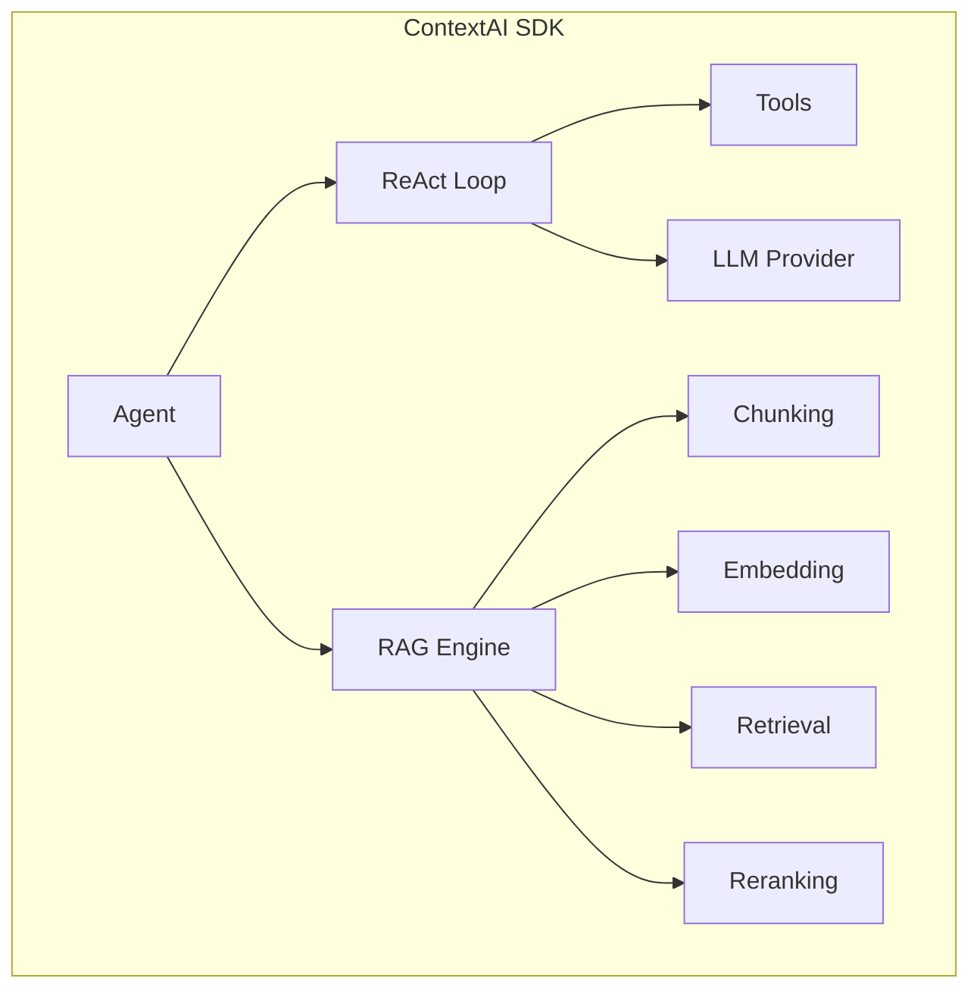

# Overview

ContextAI SDK is a TypeScript-first framework for building AI agents with transparent reasoning and production-grade RAG capabilities.

## What is ContextAI?

ContextAI provides three core capabilities:

1. **ReAct Agents** - AI agents that reason through problems step-by-step with full visibility into their thought process
2. **Tool Framework** - Type-safe tool definitions with Zod validation
3. **RAG Pipeline** - Production-grade retrieval-augmented generation with 9 configurable stages



## Core Principles

### 1. Transparency Over Magic

Every decision an agent makes is visible in its trace:

```typescript
const response = await agent.run('What is 2 + 2?');

// See exactly what the agent thought and did
console.log(response.trace);
// {
//   steps: [
//     { type: 'thought', content: 'User wants a simple calculation' },
//     { type: 'action', tool: 'calculator', input: { expr: '2 + 2' } },
//     { type: 'observation', result: { success: true, data: 4 }, success: true },
//     { type: 'thought', content: 'I have the answer' }
//   ]
// }
```

Compare this to black-box frameworks where you have no idea why the agent behaved a certain way.

### 2. Composition Over Inheritance

No deep class hierarchies. Every component is composable:

```typescript
// Compose exactly what you need
const agent = new Agent({
  llm: new OpenAIProvider({ model: 'gpt-4o' }),  // Swap providers
  tools: [searchTool, calculatorTool],           // Add tools
  memory: new InMemoryProvider(),                // Optional memory
});
```

### 3. Type Safety Throughout

Full TypeScript support with strict mode:

```typescript
// Tool parameters are type-safe
const weatherTool = defineTool({
  name: 'weather',
  parameters: z.object({
    city: z.string(),
    unit: z.enum(['celsius', 'fahrenheit']),
  }),
  execute: async ({ city, unit }, context) => {
    // city: string, unit: 'celsius' | 'fahrenheit' (auto-inferred from Zod!)
    const data = await getWeather(city, unit);
    return { success: true, data };
  },
});
```

### 4. Minimal Dependencies

The core package is under 50KB with no native modules:

```
@contextaisdk/core: ~15KB
@contextaisdk/rag:  ~25KB
@contextaisdk/react: ~10KB
```

## Package Architecture

```
@contextaisdk/
├── core           # Agent loop, tools, interfaces
├── rag            # RAG engine, chunking, retrieval
├── react          # React components and hooks
├── provider-*     # LLM providers (OpenAI, Anthropic, Ollama)
├── embeddings-*   # Embedding providers
└── vectorstore-*  # Vector store adapters
```

### Core Package

The foundation with:
- `Agent` class with ReAct reasoning
- `defineTool()` for type-safe tools
- `LLMProvider` interface for any LLM
- Streaming support via async generators

### RAG Package

Complete RAG pipeline with:
- Document loaders
- Multiple chunking strategies
- Dense, sparse, and hybrid retrieval
- Cross-encoder and MMR reranking
- Token-aware context assembly

### React Package

Headless UI components:
- `useChat`, `useAgent`, `useAgentStream` hooks
- `ChatWindow`, `MessageList`, `MessageInput` components
- `ReasoningTrace` for visualizing agent thinking
- Full WCAG 2.1 AA accessibility

## What Makes ContextAI Different?

| Feature | ContextAI | LangChain | Vercel AI SDK |
|---------|-----------|-----------|---------------|
| Transparency | Full ReAct traces | Hidden chains | Limited |
| Type Safety | Strict TypeScript | Partial | Good |
| RAG | 9-stage pipeline | Basic | None |
| Bundle Size | <50KB core | Large | Medium |
| Learning Curve | Low | High | Low |
| Debugging | Built-in traces | Difficult | Limited |

## Use Cases

### Conversational Agents

Build chatbots that can reason and use tools:

```typescript
const supportAgent = new Agent({
  name: 'Support',
  systemPrompt: 'Help customers with their issues.',
  tools: [searchKnowledgeBase, createTicket, escalateToHuman],
});
```

### RAG Applications

Answer questions from your documents:

```typescript
const rag = new RAGEngineImpl({ /* config */ });
await rag.ingest(documents);
const answer = await rag.search('How do I reset my password?');
```

### Agentic RAG

Let agents decide when to retrieve:

```typescript
const agent = new Agent({
  tools: [
    defineTool({
      name: 'search_docs',
      description: 'Search documentation for relevant information',
      parameters: z.object({ query: z.string() }),
      execute: async ({ query }, context) => {
        const results = await rag.search(query);
        return { success: true, data: results };
      },
    }),
  ],
});
```

## Next Steps

- [Installation](./installation.md) - Set up ContextAI
- [Quickstart](./quickstart.md) - Build your first agent
- [Why ContextAI?](./why-contextai.md) - Detailed comparison
