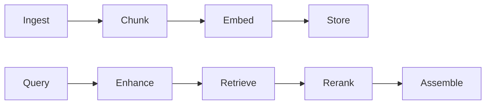

# Why ContextAI?

A detailed comparison with other popular AI SDKs and when to choose ContextAI.

## The Problem with Existing SDKs

### LangChain: Over-Abstraction

LangChain pioneered AI application development but suffers from:

```python
# LangChain: What does this actually do?
chain = (
    RunnablePassthrough.assign(context=itemgetter("question") | retriever)
    | prompt
    | model
    | StrOutputParser()
)
```

Problems:
- **"Chain of Chains"** - Deeply nested abstractions make debugging impossible
- **Magic Methods** - Behavior hidden behind operator overloading
- **Dependency Bloat** - Pulls in dozens of transitive dependencies
- **Python-First** - TypeScript support is an afterthought

### Vercel AI SDK: Limited Scope

The Vercel AI SDK is great for simple chat, but:

```typescript
// Vercel: No RAG, limited agent capabilities
const { messages, input, handleSubmit } = useChat();
```

Limitations:
- **No RAG Pipeline** - Build everything yourself
- **No Agent Reasoning** - Just chat completion wrapper
- **Streaming-Only Focus** - Not designed for complex workflows

### LlamaIndex: Python-Centric

Excellent for RAG but:
- **Python-First** - JavaScript SDK is limited
- **Complex Configuration** - Many moving parts
- **Vendor Lock-in** - Tight coupling to specific vector stores

## How ContextAI is Different

### 1. Transparent Reasoning

Every step of agent reasoning is visible:

```typescript
const response = await agent.run('Find me cheap flights to Tokyo');

// ContextAI: See exactly what happened
console.log(response.trace);
// Step 1: Thought - "I need to search for flights"
// Step 2: Action - search_flights({ destination: 'Tokyo' })
// Step 3: Observation - [flight results...]
// Step 4: Thought - "I found several options, let me present the cheapest"

// LangChain: ???
```

### 2. No Magic

Explicit composition instead of hidden behavior:

```typescript
// ContextAI: Clear what each part does
const agent = new Agent({
  name: 'Travel Agent',
  systemPrompt: 'Help users plan trips.',
  llm: new OpenAIProvider({ model: 'gpt-4o' }),
  tools: [searchFlights, bookHotel],
  memory: new InMemoryProvider(),
});

// vs LangChain: What does | do? What is itemgetter?
chain = prompt | model | parser
```

### 3. Production-Grade RAG

Complete 9-stage pipeline, not just embedding + search:



```typescript
// ContextAI: Full RAG control
const rag = new RAGEngineImpl({
  chunker: new RecursiveChunker({ chunkSize: 512 }),
  retriever: new HybridRetriever({
    denseWeight: 0.7,
    sparseWeight: 0.3,
    fusionMethod: 'rrf',
  }),
  reranker: new BGEReranker({ model: 'bge-reranker-base' }),
  assembler: new XMLAssembler({ maxTokens: 4000 }),
});
```

### 4. TypeScript-First

Not a Python port. Designed for TypeScript:

```typescript
// Full type safety with Zod
const tool = defineTool({
  name: 'weather',
  description: 'Get weather for a city',
  parameters: z.object({
    city: z.string().min(1),
    unit: z.enum(['celsius', 'fahrenheit']).default('celsius'),
  }),
  execute: async ({ city, unit }, context) => {
    // TypeScript knows: city is string, unit is 'celsius' | 'fahrenheit'
    const data = await fetchWeather(city, unit);
    return { success: true, data };
  },
});

// Type errors at compile time, not runtime
tool.execute({ city: 123 }); // TS Error!
```

### 5. Minimal Bundle Size

Tree-shakeable with no native modules:

| Package | Size | Dependencies |
|---------|------|--------------|
| @contextaisdk/core | ~15KB | 1 (zod) |
| @contextaisdk/rag | ~25KB | 3 |
| @contextaisdk/react | ~10KB | 0 (peer: react) |
| **Total (core use)** | **~15KB** | |

Compare to LangChain's hundreds of KB and dozens of dependencies.

## Feature Comparison

### Agents & Tools

| Feature | ContextAI | LangChain | Vercel AI | LlamaIndex |
|---------|-----------|-----------|-----------|------------|
| ReAct Reasoning | Full traces | Hidden | None | Basic |
| Tool Validation | Zod schemas | JSON Schema | Zod | Python typing |
| Streaming Tools | Async generators | Callbacks | SSE | Callbacks |
| Multi-turn Memory | Built-in | Requires config | Manual | Built-in |

### RAG Pipeline

| Feature | ContextAI | LangChain | Vercel AI | LlamaIndex |
|---------|-----------|-----------|-----------|------------|
| Chunking | 3 strategies | Basic | None | Multiple |
| Hybrid Search | Built-in | Requires setup | None | Built-in |
| Reranking | BGE, MMR, LLM | Basic | None | Built-in |
| Token Budget | Auto-managed | Manual | None | Manual |

### Developer Experience

| Feature | ContextAI | LangChain | Vercel AI | LlamaIndex |
|---------|-----------|-----------|-----------|------------|
| TypeScript | Native | Ported | Native | Limited |
| Debugging | Trace viewer | Difficult | Basic | Callbacks |
| Learning Curve | Low | High | Low | Medium |
| Bundle Size | Small | Large | Medium | N/A (Python) |

## When to Choose ContextAI

### Choose ContextAI When:

- You need **transparent agent reasoning** (debugging is crucial)
- You want **production RAG** with reranking and hybrid search
- You prefer **TypeScript-first** with full type safety
- You need **small bundle sizes** for browser/edge
- You value **explicit over magic** in your code

### Consider Alternatives When:

- You need **Python ecosystem** integration (use LlamaIndex)
- You want **managed infrastructure** (use Vercel AI SDK + platform)
- You need **specific LangChain integrations** (hundreds of connectors)
- Your team is **Python-first** (LangChain/LlamaIndex)

## Migration from LangChain

```typescript
// LangChain
const chain = new LLMChain({
  llm: new ChatOpenAI({ modelName: 'gpt-4' }),
  prompt: ChatPromptTemplate.fromTemplate('Answer: {question}'),
});
const result = await chain.call({ question: 'Hello' });

// ContextAI
const agent = new Agent({
  name: 'Assistant',
  systemPrompt: 'Answer questions.',
  llm: new OpenAIProvider({ model: 'gpt-4o' }),
});
const response = await agent.run('Hello');
```

## Migration from Vercel AI SDK

```typescript
// Vercel AI SDK
const { messages, input, handleSubmit } = useChat({
  api: '/api/chat',
});

// ContextAI (with direct agent access)
const { messages, sendMessage } = useChat(agent, {
  onMessage: (msg) => saveToHistory(msg),
});
```

## Summary

| Criteria | ContextAI | Best Alternative |
|----------|-----------|------------------|
| Debugging | Excellent | LlamaIndex |
| RAG Quality | Excellent | LlamaIndex |
| TypeScript DX | Excellent | Vercel AI |
| Ecosystem Size | Growing | LangChain |
| Bundle Size | Excellent | Vercel AI |
| Learning Curve | Easy | Vercel AI |

ContextAI is the best choice for TypeScript developers who need debuggable agents and production RAG without the complexity of LangChain.

## Next Steps

- [Installation](./installation.md) - Get started
- [Quickstart](./quickstart.md) - Build your first agent
- [Concepts: Agents](../concepts/agents.md) - Deep dive into architecture
