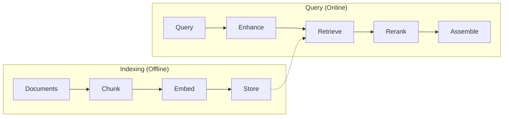

# @contextai/rag

> Production-grade RAG pipeline with hybrid retrieval, reranking, and context assembly

[](https://www.npmjs.com/package/@contextai/rag)
[](https://www.typescriptlang.org/)

## Installation

```bash
npm install @contextai/rag
# or
pnpm add @contextai/rag
```

## Overview

`@contextai/rag` implements a 9-stage RAG (Retrieval-Augmented Generation) pipeline designed for production use:



## Quick Start

```typescript
import {
  RAGEngineImpl,
  InMemoryVectorStore,
  HuggingFaceEmbeddingProvider,
  FixedSizeChunker,
  DenseRetriever,
  BGEReranker,
  MarkdownAssembler,
} from '@contextai/rag';

// 1. Set up components
const embeddings = new HuggingFaceEmbeddingProvider({
  model: 'BAAI/bge-small-en-v1.5',
});

const vectorStore = new InMemoryVectorStore({ dimensions: 384 });
const chunker = new FixedSizeChunker({ chunkSize: 512, overlap: 50 });
const retriever = new DenseRetriever({ vectorStore, embeddings, topK: 10 });
const reranker = new BGEReranker({ model: 'BAAI/bge-reranker-base' });
const assembler = new MarkdownAssembler();

// 2. Create RAG engine
const rag = new RAGEngineImpl({
  embeddingProvider: embeddings,
  vectorStore,
  chunker,
  retriever,
  reranker,
  assembler,
});

// 3. Ingest documents
await rag.ingest([
  { content: 'Your document content...', metadata: { source: 'doc.md' } },
]);

// 4. Search
const results = await rag.search('How does authentication work?');
console.log(results.context); // Formatted context for LLM
console.log(results.sources); // Source attributions
```

## Pipeline Stages

### Stage 1: Document Loading

Load documents from various sources with the `DocumentLoader` interface.

```typescript
import { DocumentLoaderRegistry, defaultRegistry } from '@contextai/rag';

// Use the default registry (supports .txt, .md, .json, code files)
const docs = await defaultRegistry.load('./documents/guide.md');

// Or register custom loaders
const registry = new DocumentLoaderRegistry();
registry.register('.custom', myCustomLoader);
```

**Supported formats:** TXT, Markdown, JSON, JavaScript, TypeScript, Python, and more.

### Stage 2: Text Chunking

Split documents into chunks using different strategies.

```typescript
import { FixedSizeChunker, RecursiveChunker, SentenceChunker } from '@contextai/rag';

// Fixed-size chunks (fastest)
const fixed = new FixedSizeChunker({
  chunkSize: 512,      // tokens
  overlap: 50,         // overlap between chunks
});

// Recursive splitting (respects document structure)
const recursive = new RecursiveChunker({
  chunkSize: 512,
  separators: ['\n\n', '\n', '. ', ' '],
});

// Sentence-based (preserves semantic boundaries)
const sentence = new SentenceChunker({
  maxChunkSize: 512,
  minChunkSize: 100,
});

const chunks = await chunker.chunk(document);
```

**Strategies:**
| Strategy | Best For | Trade-off |
|----------|----------|-----------|
| `FixedSizeChunker` | Speed, consistency | May split mid-sentence |
| `RecursiveChunker` | Structured docs | Slightly slower |
| `SentenceChunker` | Semantic coherence | Variable chunk sizes |

### Stage 3: Embedding Generation

Generate vector embeddings for chunks.

```typescript
import { HuggingFaceEmbeddingProvider, OllamaEmbeddingProvider } from '@contextai/rag';

// HuggingFace (local, via Transformers.js)
const hf = new HuggingFaceEmbeddingProvider({
  model: 'BAAI/bge-small-en-v1.5', // 384 dimensions
  // model: 'BAAI/bge-large-en-v1.5', // 1024 dimensions (higher quality)
});

// Ollama (local server)
const ollama = new OllamaEmbeddingProvider({
  model: 'nomic-embed-text',
  baseUrl: 'http://localhost:11434',
});

const embedding = await provider.embed('Your text here');
const embeddings = await provider.embedBatch(['Text 1', 'Text 2', 'Text 3']);
```

**Caching for performance:**

```typescript
import { CachedEmbeddingProvider, LRUEmbeddingCache } from '@contextai/rag';

const cache = new LRUEmbeddingCache({ maxSize: 10000 });
const cached = new CachedEmbeddingProvider({ provider: hf, cache });
```

### Stage 4: Vector Storage

Store and search embeddings.

```typescript
import { InMemoryVectorStore } from '@contextai/rag';

const store = new InMemoryVectorStore({
  dimensions: 384,
  distanceMetric: 'cosine', // 'cosine' | 'euclidean' | 'dotProduct'
});

// Add chunks
await store.add(chunksWithEmbeddings);

// Search
const results = await store.search(queryEmbedding, {
  topK: 10,
  filter: { source: 'docs.md' }, // Metadata filtering
});
```

**Available stores:**
- `InMemoryVectorStore` - Development and testing
- pgvector (PostgreSQL) - Production (via adapter)
- ChromaDB - Self-hosted vector DB (via adapter)

### Stage 5: Query Enhancement

Improve retrieval quality by enhancing queries.

```typescript
import { QueryRewriter, HyDEEnhancer, MultiQueryExpander } from '@contextai/rag';

// Query rewriting (fix typos, expand abbreviations)
const rewriter = new QueryRewriter({ llm: yourLLM });
const rewritten = await rewriter.enhance('how does auth wrk?');
// → "How does authentication work?"

// HyDE (Hypothetical Document Embeddings)
const hyde = new HyDEEnhancer({ llm: yourLLM, embeddings });
const enhanced = await hyde.enhance('authentication flow');
// Generates hypothetical answer, embeds that instead

// Multi-query expansion
const expander = new MultiQueryExpander({ llm: yourLLM, numQueries: 3 });
const queries = await expander.enhance('user login');
// → ["user login process", "authentication workflow", "sign in mechanism"]
```

### Stage 6: Retrieval

Retrieve relevant chunks using dense, sparse, or hybrid search.

```typescript
import { DenseRetriever, BM25Retriever, HybridRetriever } from '@contextai/rag';

// Dense retrieval (semantic similarity)
const dense = new DenseRetriever({
  vectorStore,
  embeddings,
  topK: 10,
});

// Sparse retrieval (keyword matching)
const sparse = new BM25Retriever({
  documents: chunks,
  k1: 1.2,
  b: 0.75,
});

// Hybrid (best of both worlds)
const hybrid = new HybridRetriever({
  denseRetriever: dense,
  sparseRetriever: sparse,
  denseWeight: 0.7,
  sparseWeight: 0.3,
  fusionMethod: 'rrf', // Reciprocal Rank Fusion
});

const results = await retriever.retrieve('authentication flow');
```

**RRF (Reciprocal Rank Fusion):**

```typescript
import { reciprocalRankFusion, DEFAULT_RRF_K } from '@contextai/rag';

const fused = reciprocalRankFusion([denseResults, sparseResults], {
  k: DEFAULT_RRF_K, // 60
});
```

### Stage 7: Reranking

Re-score and re-order results for higher relevance.

```typescript
import { BGEReranker, MMRReranker, LLMReranker } from '@contextai/rag';

// Cross-encoder reranking (most accurate)
const bge = new BGEReranker({
  model: 'BAAI/bge-reranker-base',
});

// MMR for diversity (reduces redundancy)
const mmr = new MMRReranker({
  lambda: 0.5, // Balance relevance vs diversity
  embeddings,
});

// LLM-based reranking (uses your LLM as judge)
const llm = new LLMReranker({
  llm: yourLLM,
  batchSize: 5,
});

const reranked = await reranker.rerank(query, results);
```

**Position bias mitigation:**

```typescript
import { applySandwichOrdering, applyInterleaveOrdering } from '@contextai/rag';

// Sandwich ordering (most relevant at start AND end)
const sandwiched = applySandwichOrdering(results);

// Interleave ordering (alternates high/low relevance)
const interleaved = applyInterleaveOrdering(results);
```

### Stage 8: Context Assembly

Format chunks for LLM consumption.

```typescript
import { XMLAssembler, MarkdownAssembler } from '@contextai/rag';

// XML format (Claude-preferred)
const xml = new XMLAssembler({
  rootTag: 'context',
  chunkTag: 'document',
  includeMetadata: true,
});

// Markdown format (GPT-friendly)
const md = new MarkdownAssembler({
  headerLevel: 2,
  includeCitations: true,
});

const assembled = await assembler.assemble(results, {
  maxTokens: 4000,
  deduplication: true,
});

console.log(assembled.text);    // Formatted context
console.log(assembled.sources); // Source attributions
console.log(assembled.tokens);  // Token count
```

**Token budget management:**

```typescript
import { calculateTokenBudget, applyTokenBudget } from '@contextai/rag';

const budget = calculateTokenBudget({
  maxTokens: 4000,
  reservedForPrompt: 500,
  reservedForResponse: 1000,
});

const fitted = applyTokenBudget(results, budget);
```

### Stage 9: Agentic RAG

Let the agent decide when and how to retrieve.

```typescript
import { Agent, defineTool } from '@contextai/core';

// Create a retrieve_knowledge tool
const retrieveTool = defineTool({
  name: 'retrieve_knowledge',
  description: 'Search the knowledge base for relevant information',
  parameters: z.object({
    query: z.string().describe('Search query'),
  }),
  execute: async ({ query }) => {
    const results = await rag.search(query);
    return { context: results.context, sources: results.sources };
  },
});

// Agent decides when to use RAG
const agent = new Agent({
  name: 'Assistant',
  systemPrompt: 'Use retrieve_knowledge for factual questions.',
  llm: yourLLM,
  tools: [retrieveTool],
});
```

## API Reference

### RAGEngineImpl

The main orchestrator for the RAG pipeline.

```typescript
const rag = new RAGEngineImpl({
  embeddingProvider: EmbeddingProvider;
  vectorStore: VectorStore;
  chunker?: Chunker;
  retriever?: Retriever;
  reranker?: Reranker;
  assembler?: ContextAssembler;
  queryEnhancer?: QueryEnhancer;
});

// Ingest documents
await rag.ingest(documents: Document[], options?: IngestOptions);

// Search
const results = await rag.search(query: string, options?: RAGSearchOptions);
```

### Key Interfaces

```typescript
// Document to ingest
interface Document {
  content: string;
  metadata?: Record<string, unknown>;
}

// Search results
interface RAGResult {
  context: string;           // Formatted text for LLM
  sources: SourceAttribution[];
  chunks: SearchResult[];
  metadata: RAGSearchMetadata;
  timings: RAGTimings;
}

// Embedding provider
interface EmbeddingProvider {
  embed(text: string): Promise<number[]>;
  embedBatch(texts: string[]): Promise<number[][]>;
  readonly dimensions: number;
}

// Vector store
interface VectorStore {
  add(chunks: ChunkWithEmbedding[]): Promise<void>;
  search(embedding: number[], options: SearchOptions): Promise<SearchResult[]>;
  delete(filter: MetadataFilter): Promise<number>;
}
```

## Performance Tips

1. **Use embedding caching** - Avoid re-embedding the same text
2. **Batch operations** - Use `embedBatch()` instead of individual calls
3. **Choose appropriate chunk sizes** - 256-512 tokens is often optimal
4. **Hybrid retrieval** - Combines semantic and keyword search strengths
5. **Rerank sparingly** - Cross-encoders are slow; rerank top-N only

## Error Handling

All components throw typed errors:

```typescript
import { VectorStoreError, EmbeddingError, RetrieverError } from '@contextai/rag';

try {
  await vectorStore.search(embedding, { topK: 10 });
} catch (error) {
  if (error instanceof VectorStoreError) {
    console.error('Vector store error:', error.code, error.details);
  }
}
```

## License

MIT
